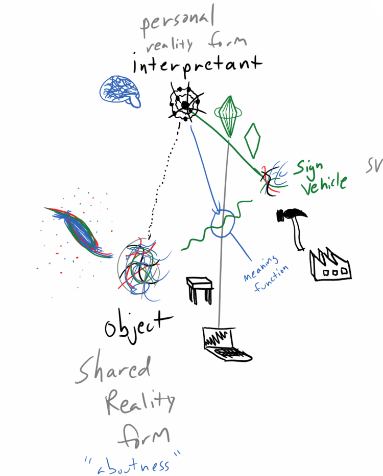
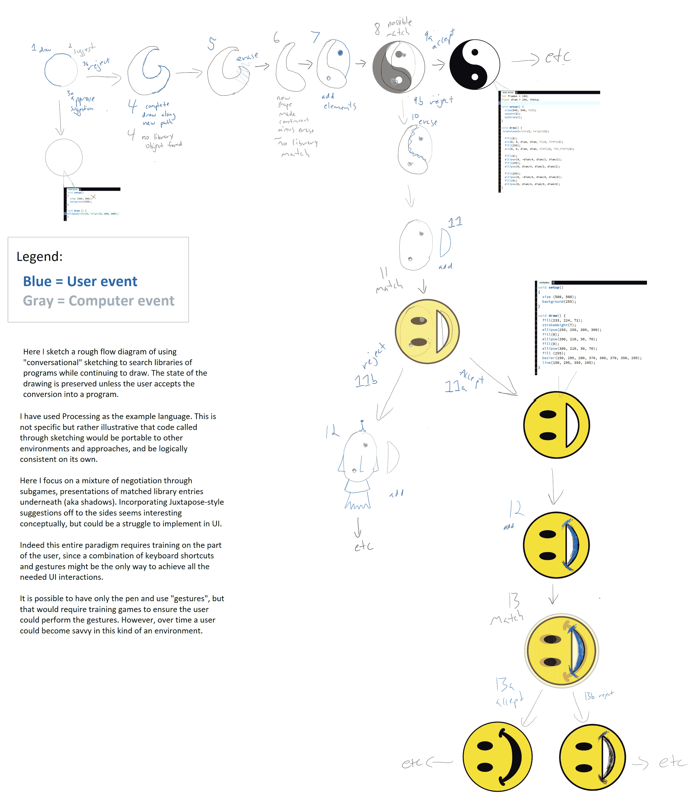
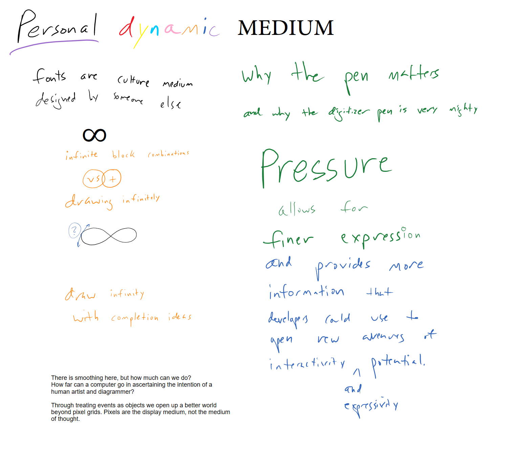
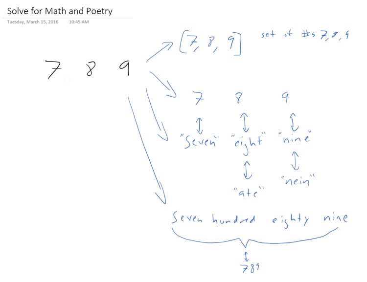

[Conversing with Computers: Retrieving the Past, Ideas for the Future](https://coda.io/d/_dD_lXK3DTPV/_sugYLgV9) (supplemental)

# As We May Sketch

Anything digitized has become an abstraction, so let's embrace it. When I draw into a computer with the flourish of my hand we can take it beyond pixels, beyond even vectors, toward universal mapping attempts, toward a truly metamedium. 

A curve drawn by hand is a chance to try fitting a function to the line. A function is just waiting to become metaphorical graphics. 

Digital ink will move beyond 'networked paper' to become a magical plane where computer vision partners with the human hand functioning as an interactive external imagination. From sketch to code, from code to sketch, no longer a pipeline but rather a constellation of possibilities, an ever-expanding network of opportunities to map expressiveness and flow to logic and math directly.

### Example: ChalkTalk

A tantalizing example to ground that fanciful poetry is available open source as webcode called ChalkTalk, which I emailed Ken Perlin about as a grad student before it was open source begging to use because, just wow how cool is this!  
https://vimeo.com/232230096

ChalkTalk now is open source and can be extended. 

https://www.youtube.com/embed/q3BAQcWficM

Yet this is not the end, rather a door. 

What happens in a world with ambient computation and representation capabilities between us to make all this part of daily life? What could we ‘say’ if we could also conjure forth dynamic programs as easily as drawing in mid air?

### Use semiotics to create external thinking support, make it interactive as digital inking.

[https://folk.computer/notes/tableshots](https://folk.computer/notes/tableshots)

Harness the power of drawing into computers to let a blank canvas become running code, bridge fuzzy expression with rigid logics into an extensible by default play/work-space for all ages.

https://youtu.be/ZZi3I_NCiUk?si=3D8XX65mZW6yOX0H

‍

While in my masters at Georgetown I worked on two papers that attempted to shed light on a latent paradigm for computer interaction centering around digitizer pens and stylus that used drawing as the method for entry at even the lower levels of computer code.

‍Retrieve ideas from the past to enable a new conversational medium.

See what wonders we create As We May Sketch.

  

As 3D technologies continue to mature I can see a path of tablets mixed with glasses that open up a kind of [dynamicland] running the full tree version of the little [Chalktalk seed]. We deserve to move beyond drawing dead fish and punching keys for code. I want to dance and sing a runtime, I want to explore our shared mind through a lucid dream as technology, a shared imagination space able to render and instantiate robust computer code.

I love computing's affordances, yet the interface is not yet complete - now it's time to bring the computer to life at the depth of mind with the speed and intuitive action of our hands.

