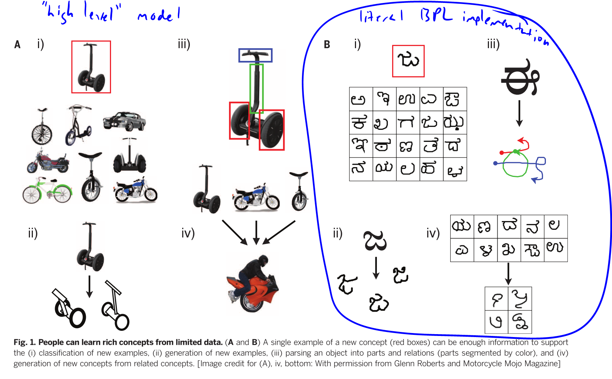
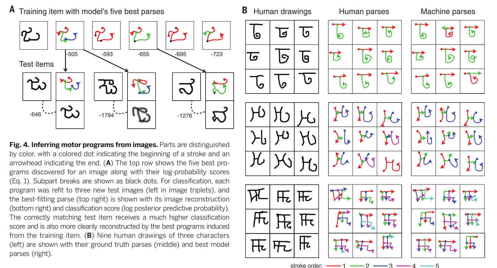

# [Bridging Rigid Logics with Blurry Imaginations](https://blogs.commons.georgetown.edu/cctp-820-fall2015/bridging-rigid-logics-with-blurry-imaginations/)

The tension between ‘what is’ and ‘what can be’ is omnipresent in technological design. The ‘what can be’ side of the tension further striates into what ‘ought be’ and ‘what can afford to be’ in an industrial economic setting. To me, nowhere is the tension between ‘what is’ and ‘what can be’ more apparent than with digital computers. These devices are substrates for logical operations, and as increasingly diverse communities of people have integrated them into their practices we see a flowering of implementations in software. Yet the initial boundary conditions of the history of computing powerfully shape what it is – where computing has been is the ground for us as we stretch to search for what it can be.

“The devices and systems of technology are not natural phenomena but the products of human design, that is, they are the result of matching available means to desired ends at acceptable cost. The available means ultimately do rest on natural laws, which define the possibilities and limits of the technology. But desired ends and acceptable costs are matters of society.” (Mahoney, 122)

So far ‘desired ends’ of the computational society have been seeded with industrial concerns and perspectives.

“the computer industry was, more than anything else, a continuation of the pre-1945 office equipment industry and in particular of the punched card machine industry.” (Mahoney, 126; quoting Haigh) “But making it universal, or general purpose, also made it indeterminate. Capable of calculating any logical function, it could become anything but was in itself nothing (well, as designed, it could always do arithmetic).” (Mahoney, 123)

Thus, in the 1970s, humanist artists began wading into computation, and we have witnessed an explosion of ‘high level’ creativity as to what the metamedium of ‘computation’ can actually do for us as meaning-makers. Ideas flourished that saw the computer as not just a machine for counting, but a substrate for human imagination. Yet the histories of computing set the devices we compute with on a path that has shaped its form: a device with baked-in logics that we recombine. The histories of computing feature engineering, science and data analysis as the kernel of the computer’s unfolding into the wider sociotechnical ecosystem. Art was tacked on later as an affordance of having enough 1/0s to spare. Computer programs are precise manipulations of the state of an electro-atomic system we call a computer. Yet human language too manipulates other electro-atomic systems (aka, other humans) in a much more blurry and imprecise way – yet this blurriness leaves room for emergence, and this I think is the key to the future direction of computing itself.

I am struck more and more each day by the 20th century origins of computing, and harden my resolve to lean more and more into what the 21st century of computing looks like. The future will see the “front” and “back” of computation merge into a holistic loop where generative logics allow computers to learn as they are used. The loops in our minds will be further augmented by loops through machines that begin to not just manipulate saved libraries, but increasingly generate new forms. We are, I think, at a profound crossroads in the path: will computing be continually defined by linear “processing”, or can we move it toward continuous relational inference? I think we must move to the latter, for the affordances of the future will enable and demand new human-scale ways to program computers. We are in the midst of a latent programming revolution.

This thinking has been culminating for me with the input of this class and my continued experience with the Microsoft Surface. The Surface device that I am typing this on is perhaps the perfect symbol for the crossroads that personal computing is currently in. The Surface has two distinct interface modes: the touchscreen/pen digitizer, and the keyboard. The mouse is unified with the digitizer pen decently well, but the keyboard remains a realm unto itself.

I am finding it increasingly jarring to coexist in free-flowing writing inside of digital inking applications and interfacing with programming.

To this day when writing to a computer at the level of its logical comprehension we are forced to bring our hands together and cramp over an un-changing keyboard. We input commands into the machine through keys that correspond to symbols, which in sequence will (when interpreted) illicit the electrical state of the computer to evolve step by step as fast as the system clock allows.

The more I use a pen on a grid, the more I believe that there is potentially another way to program.

The work of von Neumann and others who pioneered the study of cellular automata has shown me that computing does not have to be about direct control using predefined symbol sets, but rather can be about boundary conditions and evolution.

I wonder if we cannot use digitizer grids and pens to allow human operators to sketch with computers. Already much of the power of the computer comes to us via adding abstraction. To edit a photo with machine code directly would be impossibly tedious, but thanks to many layers of abstraction I can use a tool like photoshop to move around thousands of pixels and billions of transistors in large strokes.

Programming languages have been path dependent upon 20th century paradigms. To me, programming a digital computer feels like playing with a near-infinite movable type: there are libraries of modules that I arrange in patterns to produce sequences which instruct the machine and can even mean something to a person.

Yet I wonder, is that the only way to program computers? Must we only use rigid pre-delineated symbols?

I think we can begin to write higher level programming environments that allow us to write to our computers, not type, but actually write.

I discovered a groundbreaking paper recently which shows that a unification between the way humans reason and the way computers process might be increasingly possible and fruitful.

Researchers Lake, Salakutdinov and Tenenbaum instantiated a “machine learning” concept by creating a “Bayesian program learning (BPL) framework, capable of learning a large class of visual concepts from just a single example and generalizing in ways that are mostly indistinguishable from people.” Using digital inking they developed a technique to parse drawn symbols via vector and temporal relational information and allow the computer to generate further symbols from these inputs.

> “Concepts are represented as simple probabilistic programs—that is, probabilistic generative models expressed as structured procedures in an abstract description language.” Their framework brings together compositionality, causality and learning to learn. “As programs, rich concepts can be built ‘compositionally’ from simpler primitives. Their probabilistic semantics handle noise and support creative generalizations in a procedural form that (unlike other probabilistic models) naturally captures the abstract “causal” structure of the real-world processes that produce examples of a category.”

> “Learning proceeds by constructing programs that best explain the observations under a Bayesian criterion, and the model “learns to learn” (23, 24) by developing hierarchical priors that allow previous experience with related concepts to ease learning of new concepts (25, 26). These priors represent a learned inductive bias (27) that abstracts the key regularities and dimensions of variation holding across both types of concepts and across instances (or tokens) of a concept in a given domain.”

“In short, BPL can construct new programs by reusing the pieces of existing ones, capturing the causal and compositional properties of real-world generative processes operating on multiple scales.”

Finding this paper feels profound to me. Lake et al have been able to create a learning system that does not need huge amounts of data, but rather using smaller stochastic programs to represent concepts and building them compositionally from parts, subparts and spatial/temporal relations.

BPL is a generative model for generative models.

I am floored by this paper. Professor if you know of other work in this domain please forward it to me. The BPL approach spans so much of what we have learned in this class, and also gets us away from the traditional histories of computing with their emphasis on large datasets and toward smaller evolutionary rules-based generative computing.

Using the BPL method, concepts are represented as probabalistic relational programs, so anything entered by the human operator (or theoretically by other BPL-taught machines) becomes instantly absorbed into a formal logic and is combinatorial at a mathematically grounded and sound level.

The key of BPL is that, like human beings, it allows the computer to start working on relational categorization after just one example. This is how “machine learning” can go from tool of the corporation toward tool of the individual. We individuals do not have thousands or millions of datapoints to give to our personal computers, but we do have individual ideas that we can sketch to them.

I truly think that computer science is going through a revolution in understanding: computing  will move further away from being solely about “business machines” and cracking cyphercodes and massive datasets, and will increasingly feature generative creative inference and blurry conversation.

The BPL approach, if embedded into the OS of modern personal computing could enable humans to converse with designed emergent libraries of recominatorial mathematical artifacts. BPL is much more “as we may think” than any of the ‘neural net’ approaches that require astronomically large datasets and vast number crunching. Programming can evolve from reading “tapes” with rigid logics into sketching blurry ideas and creating relational inferences. This is not a replacement, but rather a welcome addition. The BPL approach is still “grounded” in piles of 1/0, but the way that BPL structures the 1/0s is much more modular and inherently combinatorial than previous approaches (from my limited perspective at least).

I strongly urge you to read the paper[(This version has my highlights, original is linked below)](http://blogs.commons.georgetown.edu/cctp-820-fall2015/files/2015/12/CompInterpretBLURRY-Science-2015-Lake-1332-8.pdf)– I think it will find its way into my final project, and carry forward into my continued goal to let computers embrace their possibility as substrates for human imagination. I think this approach is a keystone I have been seeking to merge ‘symbols that mean’ with ‘symbols that do’ into a unified mathematically complete “metasymbology” that will allow us to merge programming with language. Going further, the authors (and I) see no limits to using a BPL style approach to allow computers to engage with all forms of human symbolism, from language to gestures to dance moves. Even engineered devices and natural complexity, all the way to abstract knowledge such as natural number, natural language semantics and intuitive physical theories. (Lake et al, 1337)

In their history computers have been substrates for enacting human logic, moving forward computers will also become ever better substrates for enacting human dreams.

—

Sources:

Janet Murray, Inventing the Medium: Principles of Interaction Design as a Cultural Practice. Cambridge, MA: MIT Press, 2012.

Lake, Brenden M., Ruslan Salakhutdinov, and Joshua B. Tenenbaum. [“Human-Level Concept Learning through Probabilistic Program Induction.”](https://www.sciencemag.org/content/350/6266/1332) Science 350, no. 6266 (December 11, 2015): 1332–38. doi:10.1126/science.aab3050.

Michael S. Mahoney, “[The Histories of Computing(s)](https://drive.google.com/a/georgetown.edu/file/d/0Bxfe3nz80i2GeFcxSHAtbWNURWs/view?usp=sharing).” Interdisciplinary Science Reviews 30, no. 2 (June 2005).

This entry was posted in Week 9 on December 15, 2015 by John Hanacek.
