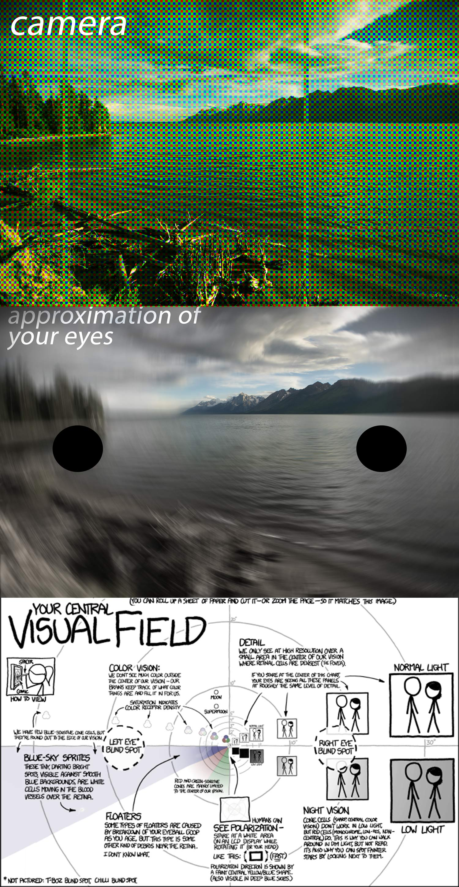
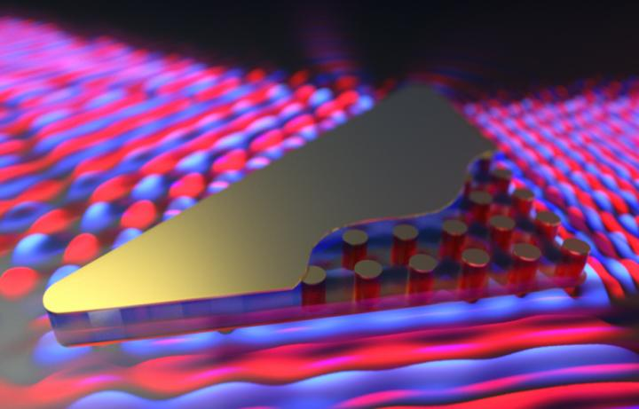

# [Humans and the Sampling Revolution](https://blogs.commons.georgetown.edu/cctp-820-fall2015/humans-and-the-sampling-revolution/)

Computers are outgrowths of our existential problem: we are finite beings in what is, to us at least, an infinite universe. All life faces this conundrum, yet only we humans have it so bad: we have the ability to ponder infinity, and that quickly leads us down roads paved only with questions.

So we sample the world, and order it to fit into our abilities. We tell stories which have beginnings, middles, and ends. Now we have built computers which execute programs that begin, run and end. Our stories and our programs are remarkably similar: they are built from human symbolic cognition. Our stories and our programs are discrete, even when they seem to run forever. In each case—story or program—there is an end state in mind.

As professor Irvine states, “writing, text, images, symbolic sounds, even 3D artefacts were never really functions of their traditional or historical media or their past substrates of representation, storage, and transmission.” (Irvine, Week 10 description) With the digital we see these forms re-conceptualized as not discrete forms themselves, but rather direct results of human symbolic cognitive desires. The digital has, in a sense of the word, freed human expression from being siloed into atomic channels—paper, wood, marble, etc—and now allows a huge majority of human cognitive endeavor to be recombined into one generalizable symbolic substrate.

When we create software we are building nested machinery, logical operations instantiated in electricity. Yet to do this, we have had to quantize the desired operation, we have to explode it into pieces. Digitizing is an act of breaking apart into pieces, so that we can recombine the pieces again later. When we capture lightwaves of a scene into a digital photograph we have not kept the continuum, but rather made a slice of counted light points (photons). When we sample a human singer we must make a digital grid and overlay it on top of the analog wave.

Thus, we find it simple to capture and replay human symbolic thought, but we struggle to simulate the continual analog processes of the quantum universe. We find it simple to digitally transmit human language and artistic forms, but we find it almost impossible to make our digital machines make meaning.

That is because the digital endeavor is based around what I will call “the counting model of the world.” That is, digital technologies are inherently finite, since every process that begins on a computer must return some kind of end. Even a process that runs and runs must still return and return. The computers of today are finite systems, designed to know themselves. Humans are much more infinite, happy to encounter halting problems and make choices regardless of completeness of information. Our minds are fields, chemicals and voltage spikes. Our computers are sequential machines. The computer is not much different than a car factory in concept: inputs go in one end and outputs come out the other; in the middle there were many nested state transformations.

Of course, the key difference is that software is a strange kind of machine, one built from the same stuff it processes: information. The algorithm is specified with information, it processes information, and returns information. Computer software is a factory for state change, the substrate is a physical system that will only change state when specifically dictated to – and the secret sauce that makes it all work: the digital is essentially and categorically lossy.

Remember, even the digital computer is actually an analog machine. That is, even the explicit charges that dictate 1/0 in transistors are not finite numbers, but rather probability distributions of where one might observe an electron when one conducts the observation. Electrons don’t exist until they must exist. Electricity is a field until we try to find a point of it.

  

A form digitized is a form exploded into pieces. We begin with continuums, digitize into pieces, and re-output continuums. Yet explosions are a lossy process. The remixable affordance of digital software machines means that we gain precision at the expense of relationship. That is, when we break apart continuums into bits, the bits lose relationship to one another. We must explicitly give the exploded bits relational value, and often we do this using other strings of bits. Modern forms of programming, such as neural networks and deep learning, are attempts to regain continuum, to reclaim relational information inside of the digital. Still they struggle because they are using serial processing of discrete units as their substrate. The substrate of most other physical systems is not discrete units, but continuous fields.

  

Light is a wave that expresses itself as particles under the right conditions. The overall state of lightwaves is relational by default since it is a continuous field. – http://phys.org/news/2015-03-particle.html

  

Digital systems throw away waves and create a human-standardized relational definition of amplitude. Essentially, digital systems guess at what is in between the points. The universe does this inherently by being a continuum, in digital systems humans have created a counted continuums and must re-assemble relational information after the initial explosion of digitization.

All human existence and endeavor is a kind of sampling, a reduction of the total possibility space of reality into a working model.

When we make a sample of reality we have reduced it from the entirety of its continuum. Even your brain does this! When you perceive a scene you have “thrown away” light wavelengths in the infrared and ultraviolet spectrum, and also radio light and x-ray and terahertz light. As well you sample the moment for only a moment, only a retina-full of the photonic light pulses are incorporated into your working model of the moment.  
In fact, your perception itself is the result of your brain applying image transformation and coloration adjustments to the actual data coming in from your retina.

You, my friend, are not seeing the world, you are making a rendering of the world. You are sampling the world, just in a different way than a digital computer.

I made this example (it is crude, not exact – meant for illustrative purposes)

As you scan around the scene with your fovea (center part of your retina) you gather in information about the light reflecting off the surfaces of the world. Your brain then assembles this into a holistic vision of what you call “reality.” Of course, you are not seeing “reality,” but a sample of reality. This is why no one agrees what color the dress is: we are all building a slightly different rendering of reality.

What I want to impress upon you is that digital technologies are taking us beyond just “media” as we have known, and are now a vehicle by which we interrogate the very concept of “sampling”. Now that we can sample reality with digital precision—now that we are building models that have logic that is discretely quantized—we are being faced with new opportunities to compare the fundamental limits and affordances of quantization: how far can digital take us when we live in an analog universe?

When I look at digital technologies, particularly now from the understanding gained in this class, I see part of a human toolkit that grew right out from our desire to sample the world. Digital systems let us chop up the world into bits. Digital systems are machines inside themselves. And as we go forward, we will use digital systems to attempt to reflect back on ourselves: if computers are artifacts of human cognition, can they not reflect our ability to sample the world?

Remember friends, you are not a god perceiving truly, rather you are an information processor grasping for and assembling a model of meaning from the thin slice of the continuum that your sensors can capture. You are using a more “analog” form of processing than our current digital machines. This is a clue. We are at the cusp of different kinds of information processing machines, ones that do not involve exploding waves into points, but rather systems that revolve around modulating continuums and observing state fluctuations over time. The digital will remain, since it is a powerful affordance, as has been well documented at this point. Counting the world lets us attempt to order it. When we send digital information between computers we are speaking a language made of logic machines. But if we are to understand ourselves and our universe more fully, we will need to move beyond mere counting and embrace the wave nature of nature. We humans have learned to explode the analog into digital, now we must learn how process the continuum.

Zero-index silicon manipulation/modulation of lightwaves at the nanoscale.

—

Sources:

Ron White and Timothy Downs. [How Digital Photography Works](https://drive.google.com/a/georgetown.edu/file/d/0Bxfe3nz80i2Gc19aRHBLUC05dE0/view?usp=sharing). 2nd ed. Indianapolis, IN: Que Publishing, 2007.

New metamaterial enables refractive index of zero – [http://optics.org/news/6/10/17](http://optics.org/news/6/10/17)

The first ever photograph of light as both a particle and wave –[http://phys.org/news/2015-03-particle.html](http://phys.org/news/2015-03-particle.html)

What an Electron is – [http://faculty.wcas.northwestern.edu/~infocom/The%20Website/plates/Plate%201.html](http://faculty.wcas.northwestern.edu/~infocom/The%20Website/plates/Plate%201.html)

Jannis Kallinikos, Aleksi Aaltonen, and Attila Marton. “[A Theory of Digital Objects](http://firstmonday.org/ojs/index.php/fm/article/view/3033/2564).” First Monday 15, no. 6 (June 5, 2010). http://firstmonday.org/ojs/index.php/fm/article/view/3033/2564.

John Watkinson, [Art of Digital Audio](https://drive.google.com/a/georgetown.edu/file/d/0Bxfe3nz80i2GQm43dGg5bGxGUE0/view?usp=sharing). 3rd ed. Oxford; Boston: Focal Press, 2000.

Paul M. Leonardi, “[Digital Materiality? How Artifacts without Matter, Matter](http://firstmonday.org/ojs/index.php/fm/article/view/3036).” First Monday 15, no. 6 (2010). http://firstmonday.org/ojs/index.php/fm/article/view/3036

Martin Irvine – Weel 10 http://faculty.georgetown.edu/irvinem/CCTP820/

This entry was posted in Week 10 on November 11, 2015 by John Hanacek.
