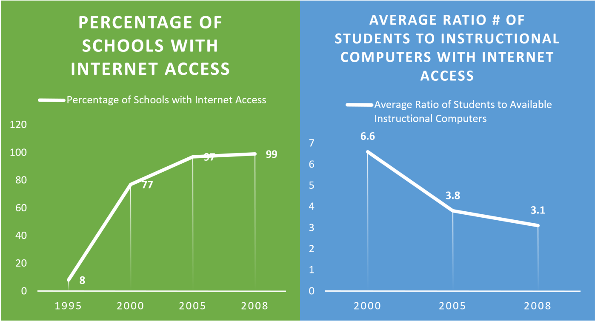
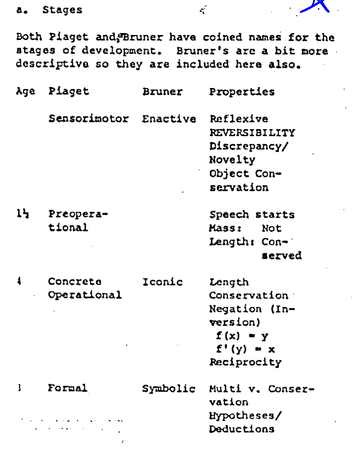
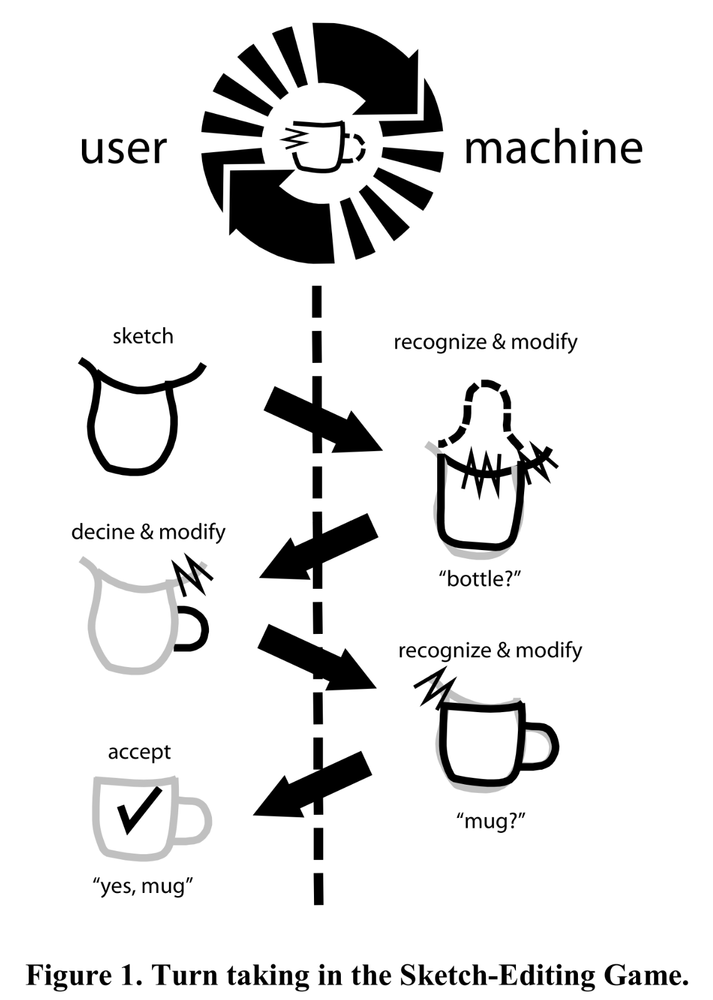
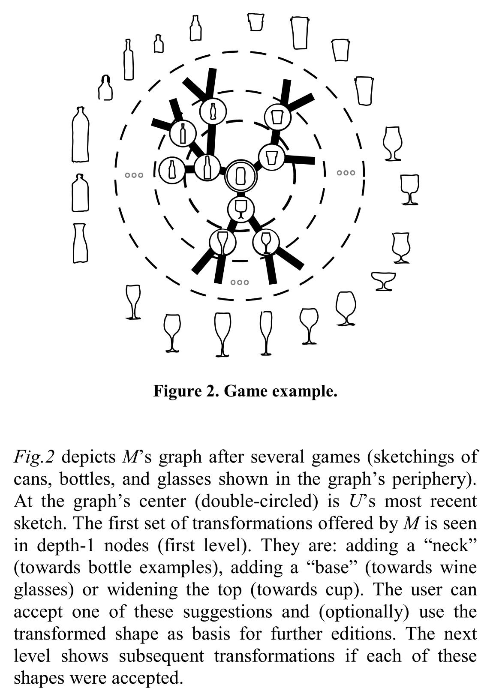
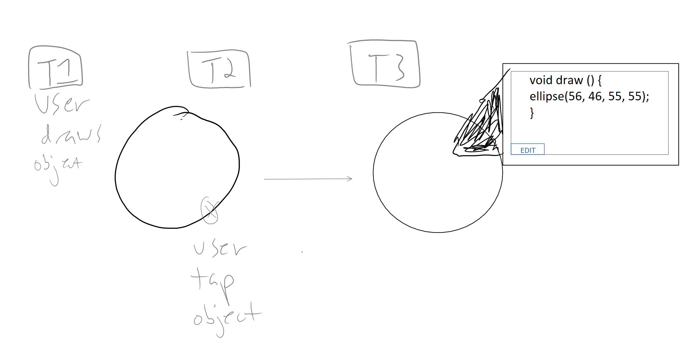
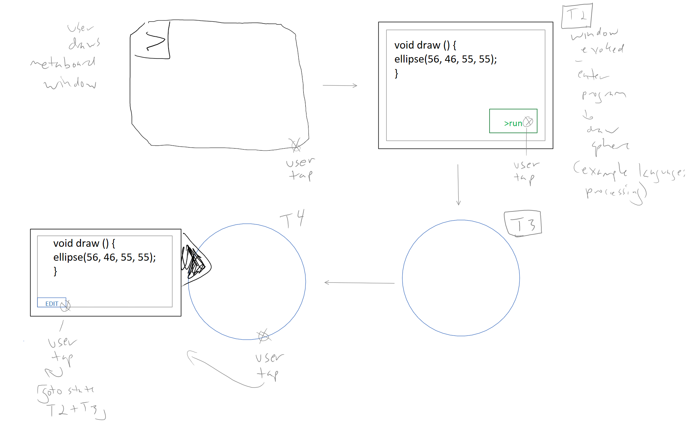
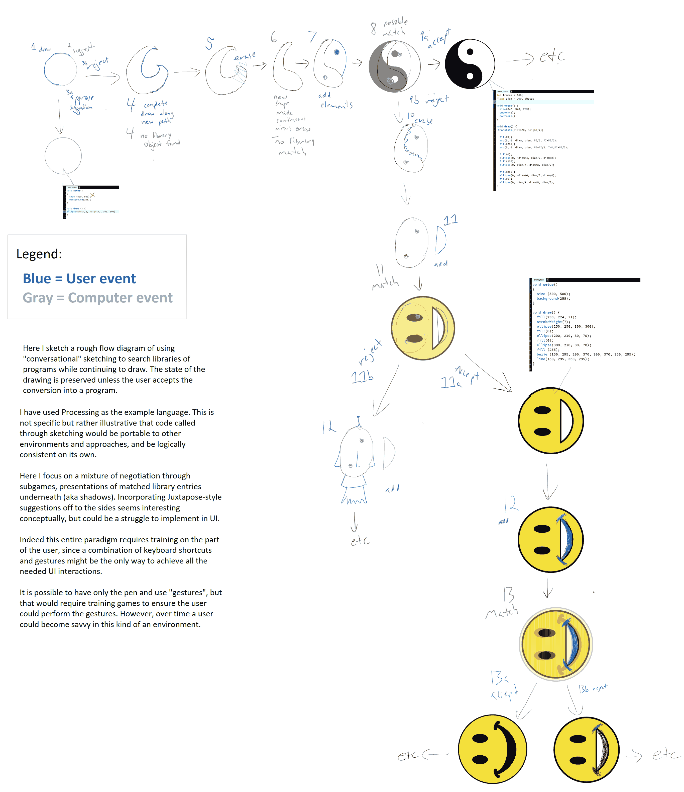

# Conversing with Computers: Retrieving the Past, Ideas for the Future

2015 CCT Final Essay

[https://blogs.commons.georgetown.edu/cctp-820-fall2015/author/jjh111/page/2/](https://blogs.commons.georgetown.edu/cctp-820-fall2015/author/jjh111/page/2/)

  

“Should the computer program the kid, or should the kid program the computer?” – Seymour Papert

ABSTRACT:

The modern computer is an incredible metamedium, a device capable of simulating most previous media forms, from photography, drawing, video, audio, etc. As computers have been connected to one another through the Internet we have witnessed an explosion of human creativity in art, design, technology, engineering and science. The computer affords humans to play with ideas in a way never before possible.

At the same time as computer software has enabled vast affordances for creativity, the public education system in the US has not kept pace and is suffering a decline in buy-in from parents and students. It has been said that schools [“kill creativity”](https://www.youtube.com/watch?v=iG9CE55wbtY) and a growing movement is seeing kids thrive when they are allowed to express and explore in individual ways outside of formal institutional structures.

As a society, we are increasingly realizing that education should not be about test results and standard metrics, but rather should foster future generations who can design complex systems, interrogate logical concepts, manage projects, create rich aesthetic forms, etc. We need a generation who is deeply and widely creative. We need education that fosters imagination, for the future is far from certain and children will need to be prepared for a world that we cannot imagine.

We can create a generation ready to handle complex uncertainty by fostering skills in hacking and programming computers. Programming offers a rich conceptual bridge between artistry and engineering. Programming requires one to develop skills in reasoning, planning, strategy and tactics, and conceptual thinking. To address the need to foster creativity, can we create a computing software environment where young children can organically discover how to realize their imaginations using computers?

To this end, I ask a more focused question: Can we use sketching into computers to help teach concepts of logic? Or more grandiosely: Can we allow young children to use their innate drawing abilities to explore advanced concepts in programming and logic at their own pace all while their hearts and minds are engaged?

I propose a forwarding the design thinking behind Alan Kay’s Dynabook concept, while updating it with new research into sketch-based learning and creation tools. This piece is broken into 4 parts with a conclusion.

In section 1 I provide a brief survey of what kinds of computers kids are using in schools.

In Section 2 I explain the Dynabook design ethos and discuss how it can inform our thinking on what computers in school should actually do.

In section 3 I collect a sample of unique and powerful work using computer sketching to teach, learn and create.

In section 4 I explore a future extensible web-based sketching exploration and instruction environment for learning advanced concepts in artistry and engineering.

---

Section 1: What kind of computers do public school students have?

Computers and the Internet are features of modern life. [In public school systems, the percentage of schools with internet access has gone from 8% to 98% in 2008.](https://nces.ed.gov/programs/digest/d12/tables/dt12_120.asp)

Not all computer paradigms are the same, and trends in modern consumer devices leave some worry as to clarity of pathways by which students may learn to become computational thinkers. In the modern computer device market there have emerged two broad class of devices. The traditional Personal Computer (PC) and the “Computational Appliance”.

Modern consumer devices are increasingly designed not to teach their users how to better understand computers at fundamental levels. Instead modern devices are consumer-centric, focusing on reducing friction to transactional actions. The computer has forked off into two styles: the traditional PC and the “Computational Appliance”. The PC is characterized by massive and user-defined extensibility to its local features. The Computational Appliance is characterized by narrow channels of extensibility.

The traditional PC often features free-floating windowed content and applications, a ‘desktop’, and a file manager. The traditional PC can be used to write executable software for itself. A traditional PC can install and run any software that is interpretable and executable by the operating system. A PC user has control over where files are stored and can add and delete files to any directory. The user also can control what software is allowed to run or not, and can manage all active tasks on the machine if so desired.

The Computational Appliance is not a full PC, it cannot install software from anywhere and it limits the users ability to modify its internal logic. In both iOS and ChromeOS the ability of students to modify and view the internal logic of the device is limited. This design decision is understandable but sub-optimal if our pedagogical goal is to foster proactive [STEAM](http://stemtosteam.org/) (Science, Technology, Engineering, Arts+Design, and Math) students. Only by taking ownership of concepts and tools do students transition into practioners.

What kind of computer is in the classroom today? Mostly computational appliances.

Focusing on US K-12 institutional purchases, the consulting form FutureSource found that there are three dominant operating system platforms being purchased in the US. Of computers bought for K-12 education in Q3 of 2015, 51.3% are running ChromeOS, while 23.3% are running Windows, while 17.3% are running iOS.

  

As of Q3 2015, 68.6% of recently purchased computers are Computational Appliances, not personal computers.

ChromeOS requires access to the Internet and cloud services in order to function. On the local side of the computer artifact itself the “operating system” is lean and focused on running web services from the cloud. Local compute power and storage capacity is limited in favor of the cloud.

Similarly, the iPad does not allow the creation of local applications or the manipulation of local functionality outside of the “app” paradigm. This is problematic since the development cycle is broken in an iPad only environment: iOS requires a Personal Computer running Mac OS X in order to create software for the iOS environment. This pathway dependence adds huge cost and complexity to the process of going from student idea to living application because of this.

Chromebook and iPad approaches are internet appliances not suited to ownership of the computational aspects of the device (they are designed as blackboxes that obscure the underpinnings of computing) Both ChromeOS and iOS do not allow the creation of binary programs. Instead, ChromeOS relies on the cloud while iOS relies on Mac OS X PCs to compile new software in the form of sandboxed ‘apps’. Both of these approaches are ideal for consumer markets, but highly problematic for educational environments.

Still, these are the appliances we have, and this is important for developers to understand. The takeaway here is that the web is the best bet for ensuring that all public schools can share the same environment.

With this in mind, let us go back to the 1970s, to a time when computer scientists like Alan Kay had invented hardware that looks like an iPad, but envisioned its software functioning very differently than it does today.

Section 2: Talking with Computers

Computers are fascinating objects. The computer can be anything those who build it want it to be. The computer, conceptually, is simply an environment where strings of symbols can be manipulated to create new strings. The computer is a state-change machine, a lattice of binary transistors that when animated using logical operations, can be programmed to perform incredibly complex actions. Through software computers come alive with human imagination.

“Although digital computers were originally designed to do arithmetic computation, the ability to simulate the details of any descriptive model means that the computer, viewed as a medium itself, can be all other media if the embedding and viewing methods are sufficiently well provided.” (Kay & Goldberg, 393) This means that a computer can display books, photos, videos, play audio and even show 3D objects. With virtual reality headsets this affordance grows. The computer is a metamedium in that it can be any almost other media that humans have previously created, and its capacity to instantiate human creativity is only growing.

Moreover computer metamedium is active, it responds to queries and experiments dynamically so that the learner can become engaged in a two-way conversation. This can be with the device software, or other human learners connected through networks and their own devices. A two-way conversational medium has never been available before except through the medium of an individual teacher.

> “External media serve to materialize thoughts and, through feedback, to augment the actual paths the thinking follows.” (Kay & Goldberg, 393)

In this spirit of a substrate for human imagination, and seeing the potentials for education the seminal American computer scientist Alan Kay proposed the idea of a “Personal Computer for Children of All Ages” called the “dynabook” in 1972. It would feature a conversational computing paradigm, wherein the users–kids and adults– would constantly add functionality to their personal machines, and share that functionality with larger communities. The ideas of “front end” user interface and “back end” structure of the operating system are much blurrier in the dynabook conception, with users able to customize almost all aspects of the design. Instead of rigid pre-defined user interface objects, the computer is viewed as a way to reflect the users’ unique way of thinking and thus acts as a substrate for instantiate any kind of application using the SmallTalk language. Developed by Kay and Adele Goldberg, among a larger team, SmallTalk is a language that is abstracted relatively high above the machine code layer of the computer and is designed to allow the creation of complex programs using intuitive phrasings.

In experiments with Smalltalk in the 1970s, Kay and Goldberg found that children were more than capable of writing programs that did serious things. From animations to entire painting programs, to musical note editing programs, to functional circuit diagrams, teens and pre-teens were able to construct useful tools using the SmallTalk language to explicitly program all the necessary elements.

The Dynabook design was not just concerned with engineering, but forwards a pedagologial philosophy.

“We feel that the child is a ‘verb’ rather than a ‘noun’, an actor rather than an object, he is not a scaled-up pigeon or rat; he is trying to acquire a model of his surrounding environment in order to deal with it; his theories are ‘practical’ notions of how to get from idea A to idea B rather than ‘consistent’ branches of formal logic, etc. We would like to hook into his current modes of thought in order to influence him rather than just trying to replace his model with one of our own.” (Kay, 1)

In Kay’s conception is that approaches to use computers to instruct are misguided, but rather computers should be used to inspire and foster intuition. “With Dewey, Piaget and Papert, we believe that children ‘learn by doing’ and that much of the alienation in modern education comes from the great philosophical distance between the kinds of things children can ‘do’ and much of the 20-century adult behavior.” (Kay, 4)

In the past, play with a bow and arrow, for example, would directly involve children in the future of adult activity. Yet in the present, there can be a wide disconnect as the child is held back from contributing to the complex adult world. As Kay writes, currently “the […] child can either indulge in irrelevant imitation (the child in a nurse’s uniform taking care of a doll) or is forced to participate in activities which will not bear fruit for many years and will leave him alienated. (mathematics: multiplication is GOOD for you– see , you can solve problems in books; ‘music: practice your violin, in three years we might tell you about music,’ etc.)” (Kay, 4) The dynabook idea helps this: programs kids make in SmallTalk do things, they are not static. Thus their attention is preserved.

The dynabook philosophy sees learning programming not just as a self-serving route to make better computer programs, but also about empowering students to make the best use of their innate abilities and grow their capacities in all aspects of life.

Much of Kay’s philosophy stems from the findings of Jean Piaget. Two ideas in particular are forwarded in Kay’s thinking: First, the idea that knowledge in young children is retained as a series of operational models, which are ad hoc, that is formed for a particular purpose, and numerous, in that the child is generating them as they are needed. From the computer science point of view operational models are, “essentially algorithms and strategies rather than logical axioms, predicates and theorems.” (Kay 5)

Comparing children’s operational models to “algorithms” might sound strange due to our modern media-hyped view of what “algorithm” means. We can better understand “algorithm” as meaning “a procedure for accomplishing a goal. This means that, while there are very polished mathematiacal computer algorithms behind Google search, there can also be algorithms for getting the couch through the doorway when you’re moving house, or making a picture have brighter exposure in a photo editing tool, and so on.

The second Piagetian notion is that child development proceeds in a sequence of stages, each one building on the past, yet featuring dramatic differences in ability to capture, generalize and predict causal relations.

  

  

How early can we engage with children’s innate abilities and limitations to enable them to start developing their own internal models of the world? Presently we try to instruct children on how to read and write as early as possible. Could we not teach them computational logic paradigms even earlier? “language does not seem to be the mistress of thought but rather the handmaiden, in that there is considerable evidence by Piaget and others that much thinking is nonverbal and iconic.” (Kay, 5) The thinking behind computer science concepts and programming is more generalizable and can be understood intuitively even without understanding all the specific syntax of programming languages.

Programming computers fosters, and indeed requires, the formation of skills concerning “thinking”: understanding of forming strategies and tactics, planning, project management, observation of causal chains, debugging and refinement, etc. These skills are not unique to computers, but computers require strong prowess in them. Therefore, the dynabook goal is to use computers to give students a place to practice these skills. The goal was to make a space where children has a space to explore that was “patient, covert and fun!” (Kay, 5) In forwarding the dynabook idea it is essential to explore the affordances of using non-linguistic forms to help students engage and practice their innate reasoning abilities. Even SmallTalk is still a language with idiosyncratic syntax, thus it is not the ideal way to expose very young children to computers.

Drawing into computers offers a perfect bridge between doodling and expanding thinking skills. The goal is not just to teach children to program in the existing languages that we can conceptualize, but to enable them to create entirely new forms of language that we cannot even imagine.

Section 3: As we May Sketch – from domain specific tools to platform for dreaming

There is a rich opportunity to use modern computer hardware with pen and touch inputs to create teaching/learning environments.

Most current work is segmented into distinct disciplines. There are systems aimed at helping users create traditional media, such as drawings and collages (shadowdraw & juxtapose). There are flow-charting, circuit design and network design interpreters. While other systems use sketching to help computer science teachers illustrate concepts. There is even a system to help classify the skill level of children as they draw.

ShadowDraw guides users toward more complex forms by comparing shapes they are drawing to a library of edge features extracted from photographs.

https://www.youtube.com/embed/zh_-HUdQwow?feature=oembed

Juxtapose facilitates the discovery of clipart objects and the assembly of those objects into collages.

https://www.youtube.com/embed/T4bdFEXONyc?feature=oembed

While CStutor enables users to draw in database diagrams and perform functions. It provides a way to bridge drawn structures and coded structures, with the two paradigms working together.

https://www.youtube.com/embed/uEja_cxrGCg?feature=oembed

From an interface perspective, Ribeiro, Andre, and Takeo Igarashi’s paper titled,  “Sketch-Editing Games: Human-Machine Communication, Game Theory and Applications” offers an interesting paradigm for allowing the computer and human user to “converse” with each other in order to agree on what object to create.

  

These figures taken from the “Sketch Edited Games” paper illustrate a fascinating paradigm for negotiating between user intention and the computers internal library. The edges of the figure are the computer guesses, while the middle of the figure is the human user.

Each of these research projects provides a fascinating possibility space, but they are currently not united in any holistic way. The goal is to allow people to engage with computers using natural sketching gestures. However they are still domain specific and focus on generating outputs very similar to their initial inputs.

One approach currently under development is unique, and provides a conceptual bridge between all previous computer sketching systems. Dr. Ken Perlin at NYU has been working on a system called Chalktalk, which is meant to serve as a proof-of-concept and teaching tool for using sketches to call complex programs.

https://www.youtube.com/embed/fvr5epZ8BEc?feature=oembed

Ken Perlin’s chalktalk offers a door for merging approaches: sketches do not merely call other sketches or 3D objects, but any form of programmatic content. Any javascript program can be called into the environment by drawing an image that triggers a match to a library of shapes that  correspond to a given program.

This approach of using sketches to call other programs in a generalizable environment could allow the instantiation of most of the previous tools into a single platform deliverable on the web. So that in the same environment that a student draws to make art another can draw to make network graphs and another can draw to design a database. Since these affordances are all in the same environment, fascinating and difficult-to-foresee new designs and understandings have chances to emerge. Art and engineering get closer to each other than they have ever been in any previous computer environment.

However in chalktalk’s current implementation the user must remember explicit shapes in exact proportions to trigger specific programs. There is slim opportunity for blurriness or being “next to” the desired program. This is fine for Chalktalk’s current usage, which is enabling instructors to teach their classes more effectively.

For letting students explore the system will need to merge in the discovery possibilities of work like Juxtapose and ShadowDraw, perhaps blending in the conversational aspect of Ribeiro, Andre, and Takeo Igarashi’s work with game theoretic sketch parsing.

With only a few modifications, Chalktalk could go from calling libraries to enabling students to draw their way to knowing how to program.

In section 4, I explore modifications to Chalktalk sourced from existing research that would allow the creation of a web-based environment that could bridge the gap between doodling and programming.

Section 4: Conversing with Computation

“If we want children to learn any particular area, then it is clearly up to us to provide them with something real and enjoyable to ‘do’ along their way to perfection of both the art and the skill. Painting can be frustrating, yet the practice is fun because a finished picture is a subgoal which can be accomplished without needing total mastery of the subject.” (Kay, 4)

This idea, of yielding encouraging subgoals during learning can be carried forward out of just drawing and into most other domains. Through sketching itself, students in supportive environments could create “pictures” which are mixes of visual, programmatic, audio, etc. Pictures which are rich media computational meta-objects: combinations of visual art, programmatic action, audio generation, links to other content, etc.

So rather than just teaching concepts, or keeping the instructional affordance of the sketching environment focused on a narrow range, the goal should instead be to create a bridging space between playing with ideas and executing complex programs.

The idea is to create a substrate by which programs can be called into the environment and combined into interaction webs that would allow the construction of higher-order complexity.

The environment ought to allow and assist the creation of “traditional” media, along with allowing users to discover whether what they are drawing has a programmatic component in the library.

The environment would allow users to view the internal logic of called programs as a tooltip that supports copy/paste & editing. There could also be a meta-whiteboard within the chalktalk environment that would allow the user to go from program to sketch directly. We can begin breaking down the distinction between previously coded assets and sketches through the use of a meta-whiteboard widget that can be invoked through a certain sketch.

In this way the “frontend” and “backend” concepts of the environment become blurred and facilitate exploration of machine interpretable code through human drawing. Moving forward we can go beyond just code/draw, draw/code of explicit objects and toward discovery of novel forms. Combining the discovery aspects of Juxtapose with a more compact interface like ShadowDraw and the “shape editing” paradigm of Sketch Games could allow for students in a chalktalk environment to search through the libraries of available programs and primitives. By sketching simple shapes, more complex forms can be presented as suggestions as the working sketch progresses.

The current chalktalk interpreter would need a complete overhaul to support this, since it is currently interested in converting a sketch only once, not continuously querying it. It will have to be overhauled though since this kind of negotiated suggestive search will be essential as the size of the backend program library grows. With hundreds or thousands, then millions of programs that could possibly be called there would be no way to remember all of them, let alone discover them, without the ability to iterate on a single sketch.

Further, the environment could have multiple layers of two different states: ‘loop’ and ‘one-way’. In loop the environment is fully editable and reveals the logic of called programs. In ‘one-way’ there can be fixed existing assets that have been drawn/programmed in. A designer could create layers of ‘background’ one-way layers then let the user have a ‘loop’ layer to engage with their pre-designed environment using sketches and new programs.

I think that such a metaenvironment would allow non-programmers to learn programming gradually by exploring the affordances of the environment. Over time a user could go from making pictures to turning those pictures into an interactive programmatic game without ever leaving the environment.

For example, I propose a game that could be possible in such an environment. This is just one example. In the metaenvironment I’m proposing, the distinction between building and playing games will be blurred, but there will currently still need to be hard-coded elements. As more primitives are created it can become increasingly possible to create higher order programs from sketching alone.

I will call the hypothetical game “TreasureProg”. It is on a 2D XY coordinate plane.

Consider a game where students are incentivized to learn how to draw forms programmatically, engage with pointer locations in database design, and consider logical ordering and efficiency. One user, acting as a constructor, might code a series of “treasure chests” that have keyholes which correspond to increasingly complex geometric shapes. Other chests could require precise sequences of numbers delivered in a row. Other chests could require access to the contents of the player’s “backpack” of previous items, so that some chests demand a level of exploration and mastery in order to reveal their contents.

The game constructor can code an avatar that can be called by sketching a stick figure. This avatar could function to allow keypad entries to control its X and Y motions, and even function like the LOGO turtle, requiring the input of pseudocode commands for moving and the ability to program the avatar to teleport to a specific global X Y position in the game space.

Naturally there would be enemies inside the game space. The player would need to construct a weapon, which if I were playing would be a hand-drawn sword. A library could exist from sticks to swords to guns. However, objects like guns would require the player to write internal code that fires a bullet.

The code sets for all these assets are then entered into the environment library on the back-end so that they can be called into the front-end of the environment by drawing or by directly querying the library and placing the asset.

Once the environment is set up in the form of a game, it is locked, and students are let in to play with it. They would be asked to draw an avatar for themselves that they will use to explore the space. The students encounter the first chest, which requires a circle to open. They draw a circle and tap on it to have it interpreted by the environment into a circle. Easy, the chest opens to reveal instructions for how to build a “backpack” hold future assets gained through puzzle interactions.

They are not given the backpack, but rather given a diagram of how to sketch the backpack, which when drawn would correspond to the actual code for the backpack. This code would be visible as an addition to the avatar character once the backpack is instantiated. As time goes on the player’s “backpack” would need to evolve to handle more and new kinds of data objects. Future puzzles will involve breaking up large objects gained from the chests, and reading from the “backpack” in sequence to develop larger key programs that utilize the users’ growing library.

One chest might reveal a whale that needs to be broken up into byte sizes to fit into the addressable memory bins of the player backpack. The user would then be faced with a choice to manually cut up the whale by drawing 8bit marks in a grid, or trying to develop a program that can do it for her, or perhaps some would choose to create a better backpack that has automatic memory bin allocation.

Some of the chests would contain coordinates for how to get to MegaChests, which contain code that gives the player’s avatar extra powers. These megachests can only be opened by sending the contents of the player backpack to the keyhole in a specified order.

And so on. The idea with TreasureProg is to let players feel they are engaged with their hands and eyes, and are having some level of customization over facets of the game.

This is merely a crudely sketched idea. It could be implemented as a standalone game, but that is not the point. The idea should not be to simply build more applications that use drawing, but to bridge drawing and programming into a functional environment. Chalktalk showed me a proof-of-concept for the future: bridging blurry inputs with structured computational outputs. I believe we can use drawing to not just teach how to program with keyboards, but to serve as its own kind of programmatic environment.

My secret goal all along with this paper and research has been to figure out how to make more humanist computers. My open questions are: how much of programming has to be precise, and can computers become more comfortable with fuzzy logic through conversations with us through drawing? There are approaches in machine learning that could enable a new kind of logical environment in which to perform computation, but I will bracket that off for now.

Conclusion:

It has been said that schools “kill creativity” and a growing movement is seeing kids thrive when they are allowed to express and explore in individual ways and outside of formal institutional structures.

https://www.youtube.com/embed/Uq-FOOQ1TpE?feature=oembed

https://www.youtube.com/embed/h11u3vtcpaY?feature=oembed

Yet the cohesion of a public education system should not be overlooked. Schools still matter, since there are kids still trapped in there. Having a nation united by a shared educational system is still a wonderful goal. School should just get a lot more fun and start taking their students much more seriously.

We do not want a generation of kids who follow the system, we need a generation of kids who can hack all systems. There are two main kinds of hacker: black hat and white hat. Black hat hackers are what students are often forced to become. Those who show exceptional skill either have to leave the system or are forced to do their experiments in hiding. They do not want to be subversive, they are merely given no other option.

Instead education should treat every child as a potential white-hat hacker. Encourage them to break things and report what they broke. Paverse said the only way to understand the world is to build it. A great way to learn how to build is to break things apart and see how they are made. Computers offer a fundamentally new affordance for humanity: we can use them to build spaces where infinite experimentation is possible. Where the cost for making a thousand instances of a object is zero. Computers are a playground for human imagination. It is time we embraced their real possibilities. It is time to let the kids hack the system.

---

# Sources explored:

> Not all of these sources are mentioned explicitly, but all were valuable in understanding where work has been and in generating ideas for where it could go in the future.

“Adele Goldberg (computer Scientist).” Wikipedia, the Free Encyclopedia, December 17, 2015. https://en.wikipedia.org/w/index.php?title=Adele_Goldberg_(computer_scientist)&oldid=695606851.

“Alan Kay.” Wikipedia, the Free Encyclopedia, November 7, 2015. https://en.wikipedia.org/w/index.php?title=Alan_Kay&oldid=689513385.

“Americans’ Internet Access: 2000-2015.” Pew Research Center: Internet, Science & Tech. Accessed December 21, 2015. http://www.pewinternet.org/2015/06/26/americans-internet-access-2000-2015/.

Association for Computing Machinery (ACM). Juxtapoze: Supporting Serendipity and Creative Expression in Clipart Compositions. Accessed December 11, 2015. https://www.youtube.com/watch?time_continue=30&v=Y2jsBcjZWVQ.

Benjamin, William, Senthil Chandrasegaran, Devarajan Ramanujan, Niklas Elmqvist, SVN Vishwanathan, and Karthik Ramani. “Juxtapoze: Supporting Serendipity and Creative Expression in Clipart Compositions.” In Proceedings of the SIGCHI Conference on Human Factors in Computing Systems, 341–50. CHI ’14. New York, NY, USA: ACM, 2014. doi:10.1145/2556288.2557327.

Browne, Jeffrey, Bongshin Lee, Sheelagh Carpendale, Nathalie Riche, and Timothy Sherwood. “Data Analysis on Interactive Whiteboards Through Sketch-Based Interaction.” In Proceedings of the ACM International Conference on Interactive Tabletops and Surfaces, 154–57. ITS ’11. New York, NY, USA: ACM, 2011. doi:10.1145/2076354.2076383.

Buchanan, Sarah, Brandon Ochs, and Joseph J. LaViola Jr. “CSTutor: A Pen-Based Tutor for Data Structure Visualization.” In Proceedings of the 43rd ACM Technical Symposium on Computer Science Education, 565–70. SIGCSE ’12. New York, NY, USA: ACM, 2012. doi:10.1145/2157136.2157297.

Cavanagh, Sean. “Chromebooks Thriving in U.S. K-12, but Is Microsoft Poised for Global Growth?” Market Brief. Accessed December 21, 2015. https://marketbrief.edweek.org/marketplace-k-12/chromebooks_thriving_in_us_k-12_but_is_microsoft_poised_for_global_growth/.

Chung, Ronald, Petrut Mirica, and Beryl Plimmer. “InkKit: A Generic Design Tool for the Tablet PC.” In Proceedings of the 6th ACM SIGCHI New Zealand Chapter’s International Conference on Computer-Human Interaction: Making CHI Natural, 29–30. CHINZ ’05. New York, NY, USA: ACM, 2005. doi:10.1145/1073943.1073950.

“Digest of Education Statistics, 2012.” Accessed December 21, 2015. https://nces.ed.gov/programs/digest/d12/tables/dt12_120.asp.

“Dynabook.” Wikipedia, the Free Encyclopedia, August 31, 2015. https://en.wikipedia.org/w/index.php?title=Dynabook&oldid=678723653.

Future of Digital Media Talks: M.D., Kurt Squire, Ken Perlin, Army Brig. Gen. Loree K. Sutton. Accessed December 19, 2015. https://vimeo.com/13580067.

Hammond, Tracy, Drew Logsdon, Joshua Peschel, Joshua Johnston, Paul Taele, Aaron Wolin, and

Brandon Paulson. “A Sketch Recognition Interface That Recognizes Hundreds of Shapes in Course-of-Action Diagrams.” In CHI ’10 Extended Abstracts on Human Factors in Computing Systems, 4213–18. CHI EA ’10. New York, NY, USA: ACM, 2010. doi:10.1145/1753846.1754128.

Internet Society Chapters Webcasting. Ken Perlin on the Future of Immersive 3D. Accessed December 19, 2015. https://www.youtube.com/watch?v=nHBAGke3eCU.

ISUE Lab. CSTutor Demo. Accessed December 20, 2015. https://www.youtube.com/watch?v=uEja_cxrGCg&feature=youtu.be.

“Kay-Dynabook-OriginalPaper-PARC-1972.pdf,” n.d.

“Kay-Goldberg-Personal-Dynamic-Media-1976.pdf,” n.d.

Kim, Hong-hoe, Paul Taele, Stephanie Valentine, Erin McTigue, and Tracy Hammond. “KimCHI: A Sketch-Based Developmental Skill Classifier to Enhance Pen-Driven Educational Interfaces for Children.” In Proceedings of the International Symposium on Sketch-Based Interfaces and Modeling, 33–42. SBIM ’13. New York, NY, USA: ACM, 2013. doi:10.1145/2487381.2487389.

Lake, Brenden M., Ruslan Salakhutdinov, and Joshua B. Tenenbaum. “Human-Level Concept Learning through Probabilistic Program Induction.” Science 350, no. 6266 (December 11, 2015): 1332–38. doi:10.1126/science.aab3050.

Lee, Yong Jae, C. Lawrence Zitnick, and Michael F. Cohen. “ShadowDraw: Real-Time User Guidance for Freehand Drawing.” In ACM SIGGRAPH 2011 Papers, 27:1–27:10. SIGGRAPH ’11. New York, NY, USA: ACM, 2011. doi:10.1145/1964921.1964922.

Lindsey, Levi Scott. “Pen-Based Interfaces for Intelligent Statics Tutoring Systems.” M.S., University of California, Riverside, 2013. http://search.proquest.com/docview/1465056972/abstract.

Perlin, Ken, and David Fox. “Pad: An Alternative Approach to the Computer Interface.” In Proceedings of the 20th Annual Conference on Computer Graphics and Interactive Techniques, 57–64. SIGGRAPH ’93. New York, NY, USA: ACM, 1993. doi:10.1145/166117.166125.

“Projects | Koç University IUI.” Accessed December 20, 2015. http://iui.ku.edu.tr/projects/.

Ribeiro, Andre, and Takeo Igarashi. “Sketch-Editing Games: Human-Machine Communication, Game Theory and Applications.” In Proceedings of the 25th Annual ACM Symposium on User Interface Software and Technology, 287–98. UIST ’12. New York, NY, USA: ACM, 2012. doi:10.1145/2380116.2380154.

Shin, HyoJong, and Takeo Igarashi. “Magic Canvas: Interactive Design of a 3-D Scene Prototype from Freehand Sketches.” In Proceedings of Graphics Interface 2007, 63–70. GI ’07. New York, NY, USA: ACM, 2007. doi:10.1145/1268517.1268530.

“Smalltalk.” Wikipedia, the Free Encyclopedia, December 2, 2015. https://en.wikipedia.org/w/index.php?title=Smalltalk&oldid=693424118.

TED. Do Schools Kill Creativity? | Sir Ken Robinson | TED Talks. Accessed December 21, 2015. https://www.youtube.com/watch?v=iG9CE55wbtY&list=LLfnx1L_Ecju0e_Q9IiAKYHA&index=2.

TEDx Talks. Forget What You Know | Jacob Barnett | TEDxTeen. Accessed December 21, 2015. https://www.youtube.com/watch?v=Uq-FOOQ1TpE&list=LLfnx1L_Ecju0e_Q9IiAKYHA&index=3.

Hackschooling Makes Me Happy | Logan LaPlante | TEDxUniversityofNevada. Accessed December 21, 2015. https://www.youtube.com/watch?v=h11u3vtcpaY&list=LLfnx1L_Ecju0e_Q9IiAKYHA&index=4.

“WIMP (computing).” Wikipedia, the Free Encyclopedia, October 14, 2015. https://en.wikipedia.org/w/index.php?title=WIMP_(computing)&oldid=685754531.

Xiao, Changcheng, Changhu Wang, and Liqing Zhang. “PPTLens: Create Digital Objects with Sketch Images.” In Proceedings of the 23rd ACM International Conference on Multimedia, 745–46. MM ’15. New York, NY, USA: ACM, 2015. doi:10.1145/2733373.2807974.

yjlee0222. ShadowDraw. Accessed December 18, 2015. https://www.youtube.com/watch?v=zh_-HUdQwow.

Yuan, Zhenming, and Guichao Jin. “Sketch Recognition Based Intelligent Whiteboard Teaching System.” In 2008 International Conference on Computer Science and Software Engineering, 5:867–70, 2008. doi:10.1109/CSSE.2008.123.

This entry was posted in Final Project on December 22, 2015 by John Hanacek.
