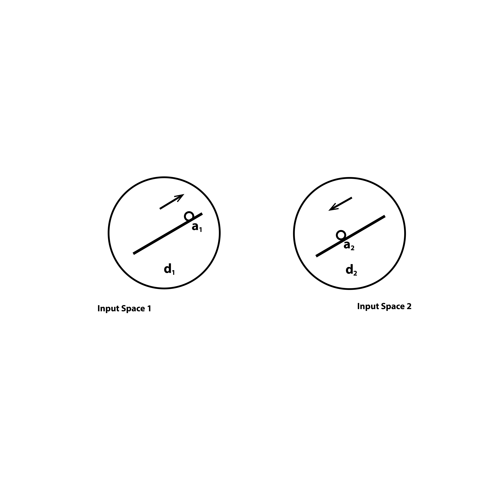
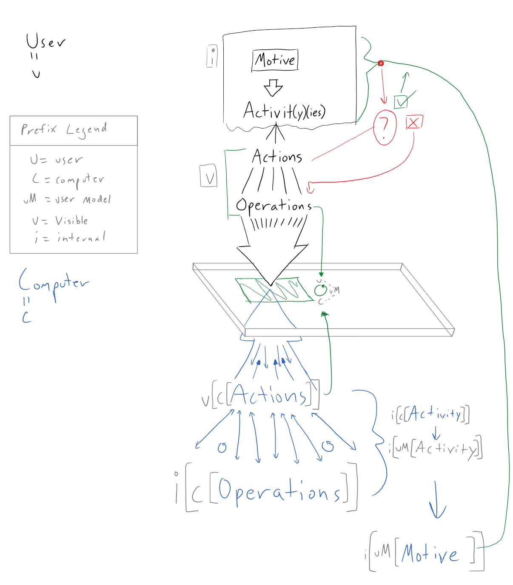

# Symbols that Do, Intention that Desires, Hands that Enact

### Programming Education for Myself and Visual Thinkers of All Ages

### [John Hanacek](https://www.johnhanacek.net/) Georgetown Communication, Culture & Technology 

2016 Masters Thesis

---

Computers are absolutely incredible achievements of human ingenuity. Computers are regions of the universe that are under a much tighter level of human control than any other physical arrangement of matter into a technology yet conceived. Inside of microchips, electricity is serving a purpose directly prescribed by a human at a keyboard.

Each computer is a special place in the universe. Computer chips are arrangements of matter that behave so predictably that numbers and mathematical operations can be encoded in patterns of their state. Every active process has a corresponding physical mapping on the microchip expressed as a pattern of semiconductors that are on or off. We see graphics on arrays of pixels, what we do not see are the datastreams coming from immense grids of switches fluttering on and off in programmed informatics. The ability to hold onto huge strings of instructions and do varying operations on those instructions has transformed mathematics into a firehose of computation, so many operations that you can paint entire 3D worlds.

External computation combined with digital networking is the most powerful technology suite humanity has ever created, and already realizing that we are enveloping the world in, to use Luciano Floridi’s term, the infosphere. None of this though is likely news to you. It seems to be common understanding that computers and computer systems are immensely powerful. Much ink and many pixels have been spent discussing the opportunities and pitfalls of an increasingly cybernetic world. Math and programming are understood as extremely influential forces today, with Lawrence Lessig declaring that code is law. With people spending increasingly large amounts of their time in digital platforms code has a more immediate impact on many lives than law now.

If I know something of this, then why is it that I do not really know how to program?

I have been trying. And I’ve been finding joy and frustration. Coming from a graphic design background I am in a foreign place when trying to understand and manipulate programs. I was always fascinated by computers and assembled PCs and hacked around, but I never learned programming. I was math phobic and thus I was programming phobic. That was the narrative I internalized. Only now am I realizing that I can learn math and programming. I can cobble things together, but I do not understand the concepts, I do not feel comfortable, I am always using duct tape, never a nice hand tool. I am on a quest to learn myself and make it easier for everyone else to learn.

I believe that everyone deserves to know how to think systematically and execute their intention in the form of computer programs. The ability to implement formal logic is part of the new literacy.

---

### Dancing Without Music

“Imagine that children were forced to spend an hour a day drawing dance steps on squared paper and had to pass tests in these ‘dance facts’ before they were allowed to dance physically. Would we not expect the world to be full of ‘dancophobes’? Would we say that those who made it to the dance floor and music had the greatest ‘aptitude for dance’?” - Mindstorms (Papert, page 43)

My childhood exposure to math was a series of facts and modules that I needed to repeat exactly for...some reason.

I was raised in a DIY family, with my dad being a competent carpenter and furniture maker. Assembling materials in 3D space is something I have always had a sense for, yet I did not manage to connect the theory of school geometry with practice. I was unable to make the analogy leap from scribbling symbols on paper to genuine internalization of the concept.

So I carried through my life that I was "bad at math" even though I would routinely use logical reasoning to fix broken computers and help my dad with construction and business. I could not see that programming was a different sort of math, I thought I just couldn't do any of it. I became a proficient user of the Adobe suite and settled into an ability to make static 2D designs. I'm finding that my tools were not designed to bridge the gap between graphic design and code. There are systems that allow the creation of interactive mockups, but I have become obsessed with the visceral input that using a digitizer pen to sketech ideas and comment on others' work allows.

In my third semester of CCT I learned how to make images in Processing and found that was the music for me to understand why I would do math, and what math can let me do. I was not unable to do math, I was simply never shown the right connection to spark my understanding.

Now I find myself as someone who is grasping the concepts of programming, but has a huge amount of experience, and an unashamed bias toward, using systems that provide the ability to manipulate on screen elements directly and offer instant, constant feedback. I want to push code around literally.

But why? Why can't I suck it up and learn? I can, and I am, but first we need to understand why I never learned to program in the first place.

### Show And Tell

In Don Norman’s “The Design of Everyday Things” he provides ‘principles of good design,’ which are:

Visibility. By looking, the user can tell the state of the device and the alternatives for action.

A good conceptual model. The designer provides a good conceptual model for the user, with consistency in the presentation of operations and results and a coherent, consistent system image.

Good mappings. It is possible to determine the relationships between actions and results, between controls and their effects, and between the system state and what is visible.

Feedback. The user receives full and continuous feedback about the results of actions.

Traditional “typed statement” programming environments live up to none of these criteria. In traditional programming it is often very difficult to determine relationships between operations and results. The feedback is not continuous and because of syntax constraints often a program being modified is not in a state where you can see the results. Systems like spreadsheets are better, since they offer easier to choose alternatives and usually allow you to see the results with just a click, providing a nice feedback loop. Norman concludes that with spreadsheets “it felt as if you were working directly on the problem, not on a computer.”

This is not just for interactive systems. I have embedded Bret Victor's example of a re-designed Social Network Analysis paper, and I urge you to play with it. You will see that the outputs of the desribed algorithms and the picture of the concept is much more apparent when you can just interact with it. We are in the web era now, there is no real reason to subject people to equatiosn alone when we can provide support structures that can help in higher-order comprehension.

I think that it should be much simpler to create the kind of rich interactive media that Victor is demonstrating. We need a graphic design tool for the modern computer era.

I would consider myself a graphic designer so I am well versed in pushing shapes around the screen and now with a tablet computer, drawing curves. In learning about programming and attempting to make my own things I find myself yearning for direct visual manipulation mechanisms. In my primitive state of thinking, I imagine something like Adobe Illustrator if the whole script of the canvas could be accessed. I want to make an object and copy it with a right click. I want to link functions together spatially on a page as I would elements of a graphic design. I want to make mathland a very real idea, instantiate it in computer graphics and give people the ability to get literally hands on with concepts.

I have a few working research questions that are guiding what I am trying to learn in order to actually understand the problem space:

Could I have a development environment that would let me get my ideas into code much faster so that I can focus on trying more complicated logic through the manipulation of visuals that provide constant feedback?

Can we drive this environment with pen input to use interactive sketching to help elucidate the concepts of programming?

Can we create visual metaphors for programming concepts, like objects and dependencies, that users can manipulate in a direct way such as in software with similar affordances of Adobe Illustrator?

Could such an environment allow younger children to organically discover how to realize their imaginations using computers?

https://player.vimeo.com/video/66085662

[Drawing Dynamic Visualizations](https://vimeo.com/66085662) from [Bret Victor](https://vimeo.com/worrydream) on [Vimeo](https://vimeo.com/).

### [Scientific Communication As Sequential Art](http://worrydream.com/ScientificCommunicationAsSequentialArt/)

  

---

### What Kinds of Visually-Oriented Programming Tools Are available?

I have used [MaxMSP](https://cycling74.com/products/max/) and looked at [VVVV](https://vvvv.org/) which are diagrammatic programming environments. It is really fascinating to manage control flow by connecting “wires” between functions, gates, variables, databases and trigger events. I find them compelling since it presents a level of interactivity that appeals to my mind, and I have even found that these styles of programming work pretty well collaboratively. Two people can look at the diagram at once and both be looking for different bugs or next steps. However, neither of these systems use different icons for different kinds of concepts, so it results in a giant tangled mess that you still have to zoom into in order to actually make sense of.

There are modular systems like [Scratch](https://scratch.mit.edu/) and [Hopscotch](https://www.gethopscotch.com/) but these are geared primarily at children and so come with unnecessary cuteness quotients and limited feature sets. I am not only interested in making games, but want to sketch entire interfaces and databases, and I think kids should be able to head in that direction too if they find themselves moving that way while working.

There is a modern version of Alan Kay's Smalltalk called [Squeak](http://squeak.org/), which functions as an Integrated Development Environment (IDE). However the interface is based primarily on the WIMP paradigm and has no pen integration. It seems to have a plethora of icons and controls.

There was also a plugin for Adobe Illustrator called [Scriptographer](http://juerglehni.com/works/scriptographer) that unfortunately broke upon API updates to Illustrator by Adobe. Scriptographer allowed the creation of graphics using javascript and the manipulation of those graphics directly in the Illustrator environment. A designer could create their own mouse-controlled drawing tools, effects that modify existing graphics, and scripts that generate new graphics.

The creator of Scriptographer, Jurg Lehni has since moved the efforts into a javascript library with the help of Jonathan Puckey called [Paper.js](http://paperjs.org/). I have been very intrigued by the affordances of paper.js, especially the [sketch.paperjs.org](http://sketch.paperjs.org/)system that lets users quickly edit and view in the web, similar to [jsfiddle](https://jsfiddle.net/) and [codepen](http://codepen.io/) although limited to paper.js implementations. [I have started getting a drawing environment set up for myself that I plan to continually improve and add to.](http://sketch.paperjs.org/#S/jVZNb+M2EP0rhIEidleVnW57UZBevJcFmm4Bd7GHJAdGGtlc06RA0vYagf97ZyjJEik5GwGGbXE+3sy8edLrRPEdTLLJagsu30ySSa4L+n/ghlXcbe6eFGsuurUR7kvlhFaW3bPX7owuC+sdKGcz5swekujQGb2F0aNSSDl64LQEw1WObn92J+cIkoMf7rODHQJScGT/aqHcf3hvGsHLtXIIL2M3SynyLeOqYIXha0xD30fGmRQK0psIRUUBsy729PdFwj4uZiNVLLXUBhO8SJ5v+3HOMwQdwqbmtpDxZ7oUJpcw7dLcJux2hp/0j1mvYnJLL7kwQJMsakqhXRN8ddq9aDklvxBEuVc5TZJp9aD3Fj7po5rCAVs0iyc7n7PPJTsCq4wu9jkU2CuP/wVKbSBhBViQkDsmXBa6ipLVueOYl2JqT4x5z0ouLdyFduc+ZrqwtLTCmvu98rBTP6nZ7C4G79MIZcH4rl53G1S9NMAdYLXk4ysm1ligQm3DaSQWTQJZ5CcR1R+NOSYlXd3ePPYAPScjlj7hVZaFZt9E4TYZ+zhigJWt6nm5DXiICbOaBpxzhXigLq/GVS+AzcbClHspT6tmgPUOR9MbTsPT071J/f5cBhtQRyncT7Yg4A0W/G0jJPh6kevGb771f3dE/qSpknGD4y4KpCMOtO1OEIg3XdNW1OtTdmGyN9YLE15ZL89PTBrUPaiYfa0KIiMla7SszU0SiCNDDUTQdqOPjD47rk6DIC3Z0JxteDzVVkvTNgF2dtXQINd7r57sQ7u3daRUglr7B8WV5sedeNAHuNYJo78jl1KODgf4m5/AvKUPJC51z6j4WRCru9+PQAwNSdL+HNAFVDdXJiwzGIVbKBLaEyt2lRTl6UKRNyb/tbpSLW1C08UlNRfx/bSz74B3wTYQ4zp6czy9XYxq3vuVIWZPo7SBKAx7XltS7Qpw26zzO492uNJrcP/0bl5bCER5ebCkklvXcvRpgp2gsE+T9klpLqdB/zEERSgoerPIf92zfr7XkGfBZB4Xz2Qe3uuL92yg8942l9qO9+Tc/4PbZ/HdJ5V6PcgbCsPAckQ85vO+VdTSISNRhlfvImXsWIiyBAP4voY+Aa9/i4OOeFdgcjzma/K+XSzQ6YHyGrQvpjGoeZjgV/KIJXNEzHoQP6CSNfJJkhaEo7OLUB7RAbdrh6pVpGzFD0KtaxXsEKPDLzehAuKr9Au+PWzr58oke3w+/w8=)

### Examples - The Pen Innovation Awaits

https://www.youtube.com/embed/T4bdFEXONyc https://www.youtube.com/embed/zh_-HUdQwowhttps://youtu.be/ZAAXvY9uiVU https://www.youtube.com/embed/uEja_cxrGCghttps://www.youtube.com/embed/VLQcW6SpJ88 https://www.youtube.com/embed/fvr5epZ8BEc

Digitizer pens are critically under-utilized input devices. The systems I have found, along with my personal experience using my Microsoft Surface Pro 4, show a world where using a computer is much more personal and even more powerful. For an entire list go to the pen-based interface section of the bibliography.

There are, in my mind, two main reasons to focus on digitizer pens: expressivity and flow.

With modern digitizer systems the pen is not just a cursor with a binary "click" like a mouse, but also offers pressure levels. When implemented, this allows for finer expression from the user and is a richer datasource for developers than traditional yes/no mouse clicks. Unfortunately, the current digitizer pen systems do not have web APIs, meaning that such experiments in utilizing pressure for interface are bound to locally compiled software.

More importantly though, writing with a pen on paper, a user can experience a state of flow: when their intention is channeled through their hand and into forms of any kind that they need to represent what they desire. Paper has no "tool modes" to select. This is the key to staying in flow: no switching modes. With a pen you are using one tool to express your intention and nuance comes from physical movements of your hands relative to other physical movements that have been recorded as ink. Using a pen on paper satisfies Norman's principles easily.

Paper is obviously limited in its scope though, so the question becomes: can digitzer pen systems be utilized in a similar slow-enducing single mode?

My experience using applications like Adobe Illustrator and Microsoft OneNote is a strange one. Both of these software systems, and indeed most software for desktop computers, were designed with the mouse and mode-switching in mind. So when I want different color inks in OneNote I need to switch modes to another pen. When I want to draw shapes in Illustrator then draw a path I need to be in a specific mode for each one. This ability to have essentially an infinitly-modal pen is very powerful, it is in keeping with the metamedium possibilities of computers and it makes sketching out and implementing graphical ideas much more visceral and intuitive.

Sketches do not need to be bitmaps, they can be comprised of points along vector paths. This allows every point and the delta between the points to already be encoded into a recognition system.

The SILK system is one of the most fascinating, expecially when compared with modern day software design tools, such as Google's [Pixate](http://www.pixate.com/) and [Adobe's Experience Design](http://www.adobe.com/products/experience-design.html). These systems are set up primarily to create applications in the style that we are now familiar of. They are machinery for creating 'killer apps'. This is helpful if you seek to create apps for consumption, yet it carries a big risk of funneling designers into a trap: if you have a tool that only makes killer apps you are like a carpenter with only a hammer, the world will look a certain way to you and you will probably end up banging away on things when you should have done something else.

That's why SILK is so fascinating, it does not start you in pre-designed templates but instead allows and encourages you to literally draw from your imagination. This creates a tool that is much more flexible and expressive.

What I think we need is a prototyping environment where we can bring in everything that has so far been utilized in interactive computing from the entire WIMP paradigm to multitouch gestures and then set it all free into a free-sketching environment. A combined environment that featured UML diagram recognition, database sketching and interface sketching would allow rapid prototyping of a much larger set of possible interaction paradigms. Does every menu have to go on the upper left side of a mobile app? What would happen if you drew a whole new and crazy kind of interface? Like so many things in design, you often cannot know until you try. I am not arguing that the modern design aesthetic and practices of apps and websites is wrong, I am merely cautioning that we could get stuck in it if our tools are too rigid.

From an interface perspective, Ribeiro, Andre, and Takeo Igarashi’s paper titled,  “Sketch-Editing Games: Human-Machine Communication, Game Theory and Applications” offers an interesting paradigm for allowing the computer and human user to “converse” with each other in order to agree on what object to create.

  

These figures taken from the “Sketch Edited Games” paper illustrate a fascinating paradigm for negotiating between user intention and the computers internal library. The edges of the figure are the computer guesses, while the middle of the figure is the human user.

Each of these research projects provides a fascinating possibility space, but they are currently not united in any holistic way. The goal is to allow people to engage with computers using natural sketching gestures. However they are still domain specific and focus on generating outputs very similar to their initial inputs.

One approach currently under development is unique, and provides a conceptual bridge between all previous computer sketching systems. Dr. Ken Perlin at NYU has been working on a system called Chalktalk, which is meant to serve as a proof-of-concept and teaching tool for using sketches to call complex programs.

https://www.youtube.com/embed/fvr5epZ8BEc?feature=oembed

We need a simple prototyping tool that allows us to freely combine different interaction methods based on their affordances. From pen strokes to mouse clicks and finger swipes all as one ‘attention cursor’ for us to dynamically iterate at maximum fidelity with the full capabilities of computer systems. A tool that recognizes diagrams, sketches databases, and creates interfaces would help us prototype many different interaction ideas quickly. Why do all mobile app menus have to be in the upper left corner? Let's try crazy new ideas instead of sticking to the same old design. We shouldn't rely too much on current design trends and tools, or we might get stuck in them.

There is a fine line here between automating design and augmenting human designers. In a fascinating talk by Tim Ewald titled ["Clojure: Programming with Hand Tools"](https://www.youtube.com/watch?v=ShEez0JkOFw) he describes the change from hand tool-based woodworking to today's modern machine woodworking. Of particular min-blowing interest to me is that in the hand tool days blueprints did not have instructions like we know them today, instead they were all based on proportion and geometric rules.

Ewald seems to think he is stretching the analogy of woodworking to programming, but I think it is not being explored enough. I want to experiment with how to literally program with actual hand tools. The visceral artistic connection achieved by working with ones hands could usher in a generation of programmers who are more connected to their work. We could see a shift from pyramids of code to cathedrals of code as [Alan Kay has long urged us to move toward.](https://www.youtube.com/watch?v=oKg1hTOQXoY)

### As We May Loop and Blend

### Fouconnier and Turner's Conceptual Blending Diagrams

  

What is human thought anyway? What are we getting up to when we imagine things or reason through problems?

Gilles Fauconnier and Mark Turner attemped to provide a framework for thinking about thinking with their illustration of "conceptual blending."

They illustrate this idea with a riddle and diagram out the steps.

A Buddhist Monk begins at dawn one day walking up a mountain, reaches the top at sunset, meditates at the top for several days until one dawn when he begins to walk back to the foot of the mountain, which he reaches at sunset. Make no assumptions about his starting or stop- ping or about his pace during the trips. Riddle: Is there a place on the path that the monk occupies at the same hour of the day on the two separate journeys?

In Fauconnier and Turner's view, this riddle is solved through the creation of an "integration network" and the manipulation of "cross-space mappings". 

The whole sequence that they present is:

> Setting up mental spaces

> Matching across spaces

> Projecting selectively to a blend

> Locating shared structures

> Projecting backward to inputs

> Recruiting new structure to the inputs of the blend

> Running various operations on the blend itself

The diagram showing the essential aspects of their theory.

This conception is compelling to me because it is presented immediately with a visual argument. Even if this theory does not completely describe human cognition, it offers a very concrete way to begin building systems that could let users manipulate and blend symbols which stand for "mental spaces" and see if they can get emergent patterns.

  

### "Thanks to a mapping, full-fledged meaning can suddenly appear in a spot where it was entirely unsuspected."

- I Am a Strange Loop (Hofstadter, page 148)

### How Would This All Come Together?

Full disclosure I do not know enough about programming to truly articulate the whole dynaPlane interaction paradigm, let along execute it. But I think that a project like this will be the key to me learning programming. What better way to learn math than to try and build a version of mathland?

For me, there are three stages to this dynaPlane vision.

The first stage is allowing programming into the creation of graphical elements in interactive Illustrator-style environments.

The second stage is exploring visual metaphors for programming concepts and experimenting with allowing the manipulation of those metaphorical icons to function as programming itself.

The third stage is exploring machine vision and machine learning to allow the reduction of discrete interaction modes and the development of more conversational, iterative design approaches to creating the desired program, whatever the program seeks to do. This is in an effort to get to no modes, as Larry Tesler urges us to do.

To achieve a version of dynaPlane with no modes would mean that the software system would effectively have to guess what the user is planning on doing next, which is a daunting problem set.

The vision is still very fuzzy in my mind because I have not yet been able to build anything to actually get my hands on. I think this will change. I have just discovered an IDE called [Light Table](http://lighttable.com/) which was written in the functional language Clojure. Light Table allows you to string together functions outside of files and inject your own code onto live web pages and many other scripts and markup languages. [The entire idea of functional programming is something that I have just discovered](https://www.youtube.com/watch?v=7Zlp9rKHGD4): instead of functions causing side effects of assigning variables state, the state of the entire program is one value and all objects and variables are referenced, never changed directly only changed inside of functions. At least as far as I've understood. This seems like a powerful conception though, since I can imagine a moment when, if it was in a functional language, an entire windowed operating system could be used as a variable for another function!

All this will surely update as I learn more. I feel as though a weight is being lifted from my shoulders the more I explore the ideas here because even if I can not make these dreams a reality, at least I am showing myself that I can learn to understand programming. I am gaining the literacy of the cybernetic world, and I hope to help pass it on.

  

## Bibliography

### Conceptual Foundations

“A Computational Account of Conceptual Blending in Basic Mathematics.” Accessed April 5, 2016. http://ccg.doc.gold.ac.uk/papers/guhe_csr11.pdf.

“A Design Space of Visualization Tasks.” Accessed April 5, 2016. https://pdfs.semanticscholar.org/b768/fd79df84859a93d397e8ac17c346fada0f59.pdf.

Alexander, James C. “Blending in Mathematics.” Semiotica 2011, no. 187 (January 2011): 1–48. doi:10.1515/semi.2011.063.

Alfred North Whitehead & Bertrand Russell. Principia Mathematica Vol 2. Accessed January 19, 2016. http://archive.org/details/PrincipiaMathematicaVol2.

Dourish, Paul, and Victoria Bellotti. “Awareness and Coordination in Shared Workspaces.” In Proceedings of the 1992 ACM Conference on Computer-Supported Cooperative Work, 107–14. CSCW ’92. New York, NY, USA: ACM, 1992. doi:10.1145/143457.143468.

“Existential Graphs MS 514 by Charles Sanders Peirce,” n.d. http://www.jfsowa.com/peirce/ms514.htm.

Grudin, Jonathan. “The Computer Reaches out: The Historical Continuity of Interface Design,” 261–68. ACM Press, 1990. doi:10.1145/97243.97284.

Jeff Gonis. Alan Kay at OOPSLA 1997 - The Computer Revolution Hasnt Happened yet. Accessed May 3, 2016. https://www.youtube.com/watch?v=oKg1hTOQXoY.

John DeNero. Alan Kay — Doing with Images Makes Symbols. Accessed December 15, 2015. https://www.youtube.com/watch?v=kzDpfk8YhlE.

Kay, A., and A. Goldberg. “Personal Dynamic Media.” Computer 10, no. 3 (March 1977): 31–41. doi:10.1109/C-M.1977.217672.

Kay, Alan. “The Center of ‘Why?’” Viewpoints Research Institute, VPRI Memo M-2004-002, 2004. http://www.vpri.org/pdf/m2004002_center.pdf.

———. “‘The Computer Revolution’, ‘Computer Science’, and ‘Software Engineering’ Haven’t Happened Yet.” In Proceedings of the 4th ACM International Conference on Embedded Software, 6–6. EMSOFT ’04. New York, NY, USA: ACM, 2004. doi:10.1145/1017753.1017758.

———. “The Dynabook - Past, Present, and Future.” In Proceedings of the ACM Conference on The History of Personal Workstations, 85 – . HPW ’86. New York, NY, USA: ACM, 1986. doi:10.1145/12178.2533809.

———. “The Power of the Context.” Viewpoints Research Institute, VPRI Memo M-2004-001, 2004. http://www.vpri.org/pdf/m2004001_power.pdf.

Kay, Alan C. “History of Programming Languages, II.” edited by Thomas J. Bergin Jr. and Richard G. Gibson Jr., 511–98. New York, NY, USA: ACM, 1996. http://doi.acm.org/10.1145/234286.1057828.

———. “Microelectronics and the Personal Computer.” Scientific American 237, no. 3 (September 1977): 230–44. doi:10.1038/scientificamerican0977-230.

———. “Smalltalk and Generic Concepts in Programming Languages.” In Proceedings of the International Conference on APL: Part 1, 340 – . APL ’79. New York, NY, USA: ACM, 1979. doi:10.1145/800136.804484.

———. “The Early History of Smalltalk.” In The Second ACM SIGPLAN Conference on History of Programming Languages, 69–95. HOPL-II. New York, NY, USA: ACM, 1993. doi:10.1145/154766.155364. ———. “The Reactive Engine.” Dissertation, University of Utah, 1969.

Lieberman, Henry. Your Wish Is My Command. Morgan Kaufmann, 2001. http://proquestcombo.safaribooksonline.com/9781558606883.

Lorna Uden, Pedro Valderas. “An Activity-Theory-Based Model to Analyse Web Application Requirements.” Text. Accessed March 3, 2016. http://www.informationr.net/ir/13-2/paper340.html.

“On the Cognitive and Logical Role of Image Schemas in Computational Conceptual Blending.” Accessed April 5, 2016. http://ceur-ws.org/Vol-1315/paper9.pdf.

Peirce, Charles S., Christian J. W. Kloesel, Max Harold Fisch, and Peirce Edition Project. Writings of Charles S. Peirce : A Chronological Edition. Volume 8 1890-1892. Bloomington: Indiana University Press, 1982. http://proxy.library.georgetown.edu/login?url=http://search.ebscohost.com/login.aspx?direct=true&AuthType=ip,uid&db=e000xna&AN=318243&site=ehost-live&scope=site.

“Peirce’s Logic | Internet Encyclopedia of Philosophy.” Accessed January 19, 2016. http://www.iep.utm.edu/peir-log/.

Rui Oliveira. Bret Victor - Inventing on Principle. Accessed May 3, 2016. https://www.youtube.com/watch?v=PUv66718DII.

“Separating Programming Sheep from Non-Programming Goats.” Accessed May 15, 2016. http://blog.codinghorror.com/separating-programming-sheep-from-non-programming-goats/.

Shin, Sun-Joo, and Eric Hammer. “Peirce’s Deductive Logic.” In The Stanford Encyclopedia of Philosophy, edited by Edward N. Zalta, Fall 2014., 2014. http://plato.stanford.edu/archives/fall2014/entries/peirce-logic/.

“Style as a Choice of Blending Principles.” Accessed April 5, 2016. http://groups.csail.mit.edu/icelab/sites/default/files/pdf/style04.pdf.

“Tatami Homepage.” Accessed April 5, 2016. http://cseweb.ucsd.edu/groups/tatami/.

TheIHMC. Jeannette M. Wing - Computational Thinking and Thinking About Computing. Accessed December 15, 2015. https://www.youtube.com/watch?v=C2Pq4N-iE4I.

“Toward a Computational Theory of Conceptual Metaphor.” Accessed April 5, 2016. https://www.aaai.org/ocs/index.php/FLAIRS/FLAIRS14/paper/viewFile/7857/7887.

“Towards a Cognitive Model of Conceptual Blending.” Accessed April 5, 2016. http://act-r.psy.cmu.edu/wordpress/wp-content/uploads/2012/12/945Guhe.pdf.

Turner, Mark B. “Blending Box Experiments, Build 1.0.” SSRN Scholarly Paper. Rochester, NY: Social Science Research Network, January 23, 2010. http://papers.ssrn.com/abstract=1541062.

Tesler, Larry. “A User Experience Retrospective.” Lecture presented at the SIGCHI-ACM, Puget Sound, 2004. http://www.nomodes.com/Larry_Tesler_Consulting/Retrospective/Pages/CHI_Retrospective.html#0.

———. “Object-Oriented User Interfaces and Object-Oriented Languages (keynote Address).” In Proceedings of the 1983 ACM SIGSMALL Symposium on Personal and Small Computers, 3–5. SIGSMALL ’83. New York, NY, USA: ACM, 1983. doi:10.1145/800219.806644.

———. “What’s It Like To Design A User Interface for Six Billion People?” In Proceedings of the SIGCHI Conference on Human Factors in Computing Systems. CHI ’11. New York, NY, USA: ACM, 2011. doi:10.1145/1978942.2167167.

“Why Johnny Can’t Program.” Accessed May 15, 2016. http://www.bricklin.com/wontprogram.htm.

### Programming Lectures

Association for Computing Machinery (ACM). “Probabilistic Programming: Algorithms, Applications and Synthesis,” Aditya Nori. Accessed February 3, 2016. https://www.youtube.com/watch?v=F4sFD9RyJrs.

ClojureTV. Tim Ewald - Clojure: Programming with Hand Tools. Accessed May 15, 2016. https://www.youtube.com/watch?v=ShEez0JkOFw.

cmurobotics. RI Seminar: Thomas Howard : Learning Models for Robot Decision Making. Accessed March 19, 2016. https://www.youtube.com/watch?v=Vf4mwYJiAt4.

gnbitcom. Robert C  Martin -  Functional Programming; What? Why? When? Accessed May 15, 2016. https://www.youtube.com/watch?v=7Zlp9rKHGD4.

MLSS Iceland 2014. Probabilistic Programming and Bayesian Nonparametrics -- Frank Wood (Part 1). Accessed February 3, 2016. https://www.youtube.com/watch?v=6Lqt07enBGs.

NewCircle Training. Functional Programming Is Terrible. Accessed May 15, 2016. https://www.youtube.com/watch?v=hzf3hTUKk8U.

Robert Attorri. Light Table Tutorial - Evaluating with Javascript. Accessed May 15, 2016. https://www.youtube.com/watch?v=oEBEa1mJD5Q.

Thomas Figg. Programming Is terrible—Lessons Learned from a Life Wasted. EMF2012. Accessed May 15, 2016. https://www.youtube.com/watch?v=csyL9EC0S0c.

### Pen Based Interface Research

“ACM Full Text PDF.” Accessed December 11, 2015. http://dl.acm.org/ft_gateway.cfm?id=2557327&type=pdf.

Alvarado, Christine, and Randall Davis. “SketchREAD: A Multi-Domain Sketch Recognition Engine.” In Proceedings of the 17th Annual ACM Symposium on User Interface Software and Technology, 23–32. UIST ’04. New York, NY, USA: ACM, 2004. doi:10.1145/1029632.1029637.

Association for Computing Machinery (ACM). CACM Apr 2015 - Sketch-Thru-Plan: A Multimodal Interface for Command and Control. Accessed February 4, 2016. https://www.youtube.com/watch?v=FKKQijakJz4.

———. Juxtapoze: Supporting Serendipity and Creative Expression in Clipart Compositions. Accessed December 11, 2015. https://www.youtube.com/watch?time_continue=30&v=Y2jsBcjZWVQ.

Bauder, Christopher. “Bringing the Virtual World into the Real World or Vice Versa: An Artistic Statement About Computer Input and Output Technologies.” In ACM SIGGRAPH 2006 Sketches. SIGGRAPH ’06. New York, NY, USA: ACM, 2006. doi:10.1145/1179849.1180083.

Bawden, D. “Information Systems and the Stimulation of Creativity.” J. Inf. Sci. 12, no. 5 (September 1986): 203–16. doi:10.1177/016555158601200501.

Bawden, David. “Information Systems and the Stimulation of Creativity.” Journal of Information Science 12, no. 5 (August 1, 1986): 203–16. doi:10.1177/016555158601200501.

Benjamin, William, Senthil Chandrasegaran, Devarajan Ramanujan, Niklas Elmqvist, SVN Vishwanathan, and Karthik Ramani. “Juxtapoze: Supporting Serendipity and Creative Expression in Clipart Compositions.” In Proceedings of the SIGCHI Conference on Human Factors in Computing Systems, 341–50. CHI ’14. New York, NY, USA: ACM, 2014. doi:10.1145/2556288.2557327.

Blaser, Andreas D., and Max. J. Egenhofer. “A Visual Tool for Querying Geographic Databases.” In Proceedings of the Working Conference on Advanced Visual Interfaces, 211–16. AVI ’00. New York, NY, USA: ACM, 2000. doi:10.1145/345513.345318.

Boris Dalstein. Vector Graphics Complexes (SIGGRAPH 2014). Accessed March 15, 2016. https://www.youtube.com/watch?v=-XONNPyeb5U.

Browne, Jeffrey, Bongshin Lee, Sheelagh Carpendale, Nathalie Riche, and Timothy Sherwood. “Data Analysis on Interactive Whiteboards Through Sketch-Based Interaction.” In Proceedings of the ACM International Conference on Interactive Tabletops and Surfaces, 154–57. ITS ’11. New York, NY, USA: ACM, 2011. doi:10.1145/2076354.2076383.

Buchanan, Sarah, and Joseph J. Laviola Jr. “CSTutor: A Sketch-Based Tool for Visualizing Data Structures.” Trans. Comput. Educ. 14, no. 1 (March 2014): 3:1–3:28. doi:10.1145/2535909.

Buchanan, Sarah, Brandon Ochs, and Joseph J. LaViola Jr. “CSTutor: A Pen-Based Tutor for Data Structure Visualization.” In Proceedings of the 43rd ACM Technical Symposium on Computer Science Education, 565–70. SIGCSE ’12. New York, NY, USA: ACM, 2012. doi:10.1145/2157136.2157297.

Cao, Yang, Hai Wang, Changhu Wang, Zhiwei Li, Liqing Zhang, and Lei Zhang. “MindFinder: Interactive Sketch-Based Image Search on Millions of Images.” In Proceedings of the 18th ACM International Conference on Multimedia, 1605–8. MM ’10. New York, NY, USA: ACM, 2010. doi:10.1145/1873951.1874299.

Cheema, Salman, and Joseph LaViola. “PhysicsBook: A Sketch-Based Interface for Animating Physics Diagrams.” In Proceedings of the 2012 ACM International Conference on Intelligent User Interfaces, 51–60. IUI ’12. New York, NY, USA: ACM, 2012. doi:10.1145/2166966.2166977.

Chung, Ronald, Petrut Mirica, and Beryl Plimmer. “InkKit: A Generic Design Tool for the Tablet PC.” In Proceedings of the 6th ACM SIGCHI New Zealand Chapter’s International Conference on Computer-Human Interaction: Making CHI Natural, 29–30. CHINZ ’05. New York, NY, USA: ACM, 2005. doi:10.1145/1073943.1073950.

Dixon, Daniel, Manoj Prasad, and Tracy Hammond. “iCanDraw: Using Sketch Recognition and Corrective Feedback to Assist a User in Drawing Human Faces.” In Proceedings of the SIGCHI Conference on Human Factors in Computing Systems, 897–906. CHI ’10. New York, NY, USA: ACM, 2010. doi:10.1145/1753326.1753459.

Dourish, Paul, and Victoria Bellotti. “Awareness and Coordination in Shared Workspaces.” In Proceedings of the 1992 ACM Conference on Computer-Supported Cooperative Work, 107–14. CSCW ’92. New York, NY, USA: ACM, 1992. doi:10.1145/143457.143468.

“Dynamically Constructed Bayes Nets for Multi-Domain Sketch Understanding.” Accessed April 5, 2016. http://rationale.csail.mit.edu/publications/Alvarado2005Dynamically.pdf.

Eitz, Mathias, James Hays, and Marc Alexa. “How Do Humans Sketch Objects?” ACM Trans. Graph. 31, no. 4 (July 2012): 44:1–44:10. doi:10.1145/2185520.2185540.

“Exploring Sketch Beautification Techniques.” Accessed April 5, 2016. https://www.cs.auckland.ac.nz/research/hci/publications/CHINZ%202005%20Exploring%20sketch%20beautification%20techniques.pdf.

“GestureBar: Improving the Approachability of Gesture-Based Interfaces.” Accessed April 5, 2016. https://cs.brown.edu/research/pubs/theses/masters/2009/bragdon.pdf.

Grundy, John, and John Hosking. “Supporting Generic Sketching-Based Input of Diagrams in a Domain-Specific Visual Language Meta-Tool.” In Proceedings of the 29th International Conference on Software Engineering, 282–91. ICSE ’07. Washington, DC, USA: IEEE Computer Society, 2007. doi:10.1109/ICSE.2007.81.

Hammond, Tracy, and Randall Davis. “Automatically Transforming Symbolic Shape Descriptions for Use in Sketch Recognition.” In Proceedings of the 19th National Conference on Artifical Intelligence, 450–56. AAAI’04. San Jose, California: AAAI Press, 2004. http://dl.acm.org/citation.cfm?id=1597148.1597222.

Hammond, Tracy, Brian Eoff, Brandon Paulson, Aaron Wolin, Katie Dahmen, Joshua Johnston, and Pankaj Rajan. “Free-Sketch Recognition: Putting the Chi in Sketching.” In CHI ’08 Extended Abstracts on Human Factors in Computing Systems, 3027–32. CHI EA ’08. New York, NY, USA: ACM, 2008. doi:10.1145/1358628.1358802.

Hammond, Tracy, Edward Lank, and Aaron Adler. “SkCHI: Designing Sketch Recognition Interfaces.” In CHI ’10 Extended Abstracts on Human Factors in Computing Systems, 4501–4. CHI EA ’10. New York, NY, USA: ACM, 2010. doi:10.1145/1753846.1754184.

Hammond, Tracy, Drew Logsdon, Joshua Peschel, Joshua Johnston, Paul Taele, Aaron Wolin, and Brandon Paulson. “A Sketch Recognition Interface That Recognizes Hundreds of Shapes in Course-of-Action Diagrams.” In CHI ’10 Extended Abstracts on Human Factors in Computing Systems, 4213–18. CHI EA ’10. New York, NY, USA: ACM, 2010. doi:10.1145/1753846.1754128.

Hammond, Tracy, Manoj Prasad, and Daniel Dixon. “Art 101: Learning to Draw Through Sketch Recognition.” In Proceedings of the 10th International Conference on Smart Graphics, 277–80. SG’10. Berlin, Heidelberg: Springer-Verlag, 2010. http://dl.acm.org/citation.cfm?id=1894345.1894383.

Jeon, Jinseong, Xiaokang Qiu, Jeffrey S. Foster, and Armando Solar-Lezama. “JSketch: Sketching for Java.” In Proceedings of the 2015 10th Joint Meeting on Foundations of Software Engineering, 934–37. ESEC/FSE 2015. New York, NY, USA: ACM, 2015. doi:10.1145/2786805.2803189.

Johnson, Gabe, Mark Gross, Ellen Yi-Luen Do, and Jason Hong. “Sketch It, Make It: Sketching Precise Drawings for Laser Cutting.” In CHI ’12 Extended Abstracts on Human Factors in Computing Systems, 1079–82. CHI EA ’12. New York, NY, USA: ACM, 2012. doi:10.1145/2212776.2212390.

Kim, Hong-hoe, Paul Taele, Stephanie Valentine, Erin McTigue, and Tracy Hammond. “KimCHI: A Sketch-Based Developmental Skill Classifier to Enhance Pen-Driven Educational Interfaces for Children.” In Proceedings of the International Symposium on Sketch-Based Interfaces and Modeling, 33–42. SBIM ’13. New York, NY, USA: ACM, 2013. doi:10.1145/2487381.2487389.

Lake, Brenden M., Ruslan Salakhutdinov, and Joshua B. Tenenbaum. “Human-Level Concept Learning through Probabilistic Program Induction.” Science 350, no. 6266 (December 11, 2015): 1332–38. doi:10.1126/science.aab3050.

Lin, James, Mark W. Newman, Jason I. Hong, and James A. Landay. “DENIM: Finding a Tighter Fit Between Tools and Practice for Web Site Design.” In Proceedings of the SIGCHI Conference on Human Factors in Computing Systems, 510–17. CHI ’00. New York, NY, USA: ACM, 2000. doi:10.1145/332040.332486.

Liu, Yang, and Yong Tsui Lee. “3D Reconstruction of Freeform Shapes from 2D Line Drawings.” In Proceedings of the 9th ACM SIGGRAPH Conference on Virtual-Reality Continuum and Its Applications in Industry, 303–10. VRCAI ’10. New York, NY, USA: ACM, 2010. doi:10.1145/1900179.1900244.

Marco Polo. Siggraph 2014: True2Form: 3D Curve Networks from 2D Sketches via Selective Regularization. Accessed March 15, 2016. https://www.youtube.com/watch?v=v7vkdNC1CgA.

Patsorn Sangkloy. The Sketchy Database: Learning to Retrieve Badly Drawn Bunnies - SIGGRAPH 2016. Accessed May 15, 2016. https://www.youtube.com/watch?v=TnU3VzXxEh4.

Paulson, Brandon, and Tracy Hammond. “PaleoSketch: Accurate Primitive Sketch Recognition and Beautification.” In Proceedings of the 13th International Conference on Intelligent User Interfaces, 1–10. IUI ’08. New York, NY, USA: ACM, 2008. doi:10.1145/1378773.1378775.

Perlin, Ken. “Eccescopy: To Look, Is to See.” XRDS 22, no. 1 (November 2015): 36–39. doi:10.1145/2810052.

———. “Quikwriting: Continuous Stylus-Based Text Entry.” In Proceedings of the 11th Annual ACM Symposium on User Interface Software and Technology, 215–16. UIST ’98. New York, NY, USA: ACM, 1998. doi:10.1145/288392.288613.

———. “The Coming Age of Computer Graphics and the Evolution of Language.” In Proceedings of the 2Nd ACM Symposium on Spatial User Interaction, 1–1. SUI ’14. New York, NY, USA: ACM, 2014. doi:10.1145/2659766.2661116.

Perlin, Ken, and David Fox. “Pad: An Alternative Approach to the Computer Interface.” In Proceedings of the 20th Annual Conference on Computer Graphics and Interactive Techniques, 57–64. SIGGRAPH ’93. New York, NY, USA: ACM, 1993. doi:10.1145/166117.166125.

Raulet, J., and V. Boyer. “A Sketch-Based Interface to Script Comics Reading.” In SIGGRAPH Asia 2011 Sketches, 3:1–3:2. SA ’11. New York, NY, USA: ACM, 2011. doi:10.1145/2077378.2077382.

Ribeiro, Andre, and Takeo Igarashi. “Sketch-Editing Games: Human-Machine Communication, Game Theory and Applications.” In Proceedings of the 25th Annual ACM Symposium on User Interface Software and Technology, 287–98. UIST ’12. New York, NY, USA: ACM, 2012. doi:10.1145/2380116.2380154.

Shalmanese. Sketching Interfaces Like Krazy (SILK) - James Landay, CHI 96. Accessed February 5, 2016. https://www.youtube.com/watch?v=VLQcW6SpJ88.

Shin, HyoJong, and Takeo Igarashi. “Magic Canvas: Interactive Design of a 3-D Scene Prototype from Freehand Sketches.” In Proceedings of Graphics Interface 2007, 63–70. GI ’07. New York, NY, USA: ACM, 2007. doi:10.1145/1268517.1268530.

“Sketching Interfaces: Toward More Human Interface Design.” Accessed March 16, 2016. http://www-ihm.lri.fr/~mbl/ENS/DEA-IHM/papers/silk-ieee.pdf.

Taele, Paul, and Tracy Hammond. “Initial Approaches for Extending Sketch Recognition to Beyond-Surface Environments.” In CHI ’12 Extended Abstracts on Human Factors in Computing Systems, 2039–44. CHI EA ’12. New York, NY, USA: ACM, 2012. doi:10.1145/2212776.2223749.

Tamy Boubekeur. PhotoSketch: A Sketch Based Image Query and Compositing System. Accessed May 15, 2016. https://www.youtube.com/watch?v=luNiuKw063w.

“True2Form: 3D Curve Networks from 2D Sketches via Selective Regularization.” Accessed March 15, 2016. http://www.cs.ubc.ca/~brianxu/publications/true2form/files/True2Form_small.pdf.

“Vector Graphics Complexes.” Accessed March 15, 2016. http://www.dalboris.com/research/vgc/vgc.pdf.

Wiberg, Mikael. “Interaction Design Meets Architectural Thinking.” Interactions 22, no. 2 (February 2015): 60–63. doi:10.1145/2732936.

Xiao, Changcheng, Changhu Wang, and Liqing Zhang. “PPTLens: Create Digital Objects with Sketch Images.” In Proceedings of the 23rd ACM International Conference on Multimedia, 745–46. MM ’15. New York, NY, USA: ACM, 2015. doi:10.1145/2733373.2807974.

Xin, Min, Ehud Sharlin, and Mario Costa Sousa. “Napkin Sketch: Handheld Mixed Reality 3D Sketching.” In Proceedings of the 2008 ACM Symposium on Virtual Reality Software and Technology, 223–26. VRST ’08. New York, NY, USA: ACM, 2008. doi:10.1145/1450579.1450627.

Zhao, Zhenpeng, Sriram Karthik Badam, Senthil Chandrasegaran, Deok Gun Park, Niklas L.E. Elmqvist, Lorraine Kisselburgh, and Karthik Ramani. “skWiki: A Multimedia Sketching System for Collaborative Creativity.” In Proceedings of the 32Nd Annual ACM Conference on Human Factors in Computing Systems, 1235–44. CHI ’14. New York, NY, USA: ACM, 2014. doi:10.1145/2556288.2557394.

### Javascript Libraries

“Fabric.js Javascript Canvas Library.” Accessed May 15, 2016. http://fabricjs.com/.

“p5.js.” Accessed May 15, 2016. https://p5js.org/.

“Paper.js.” Accessed May 15, 2016. http://paperjs.org/.
